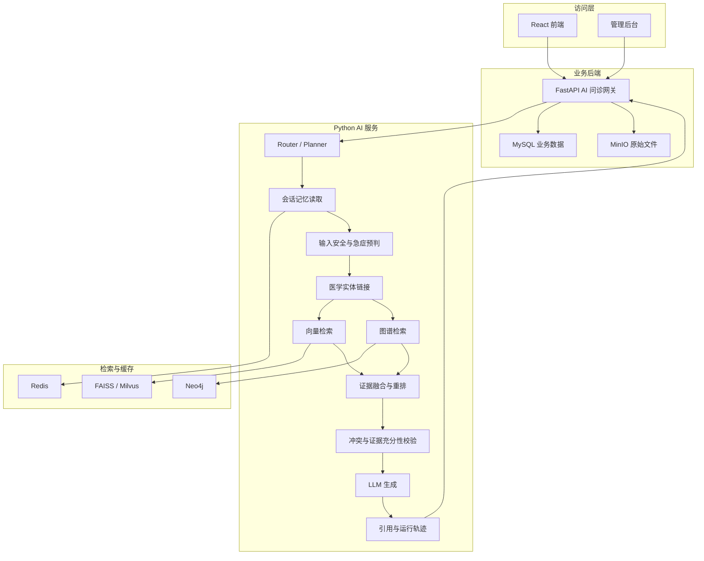
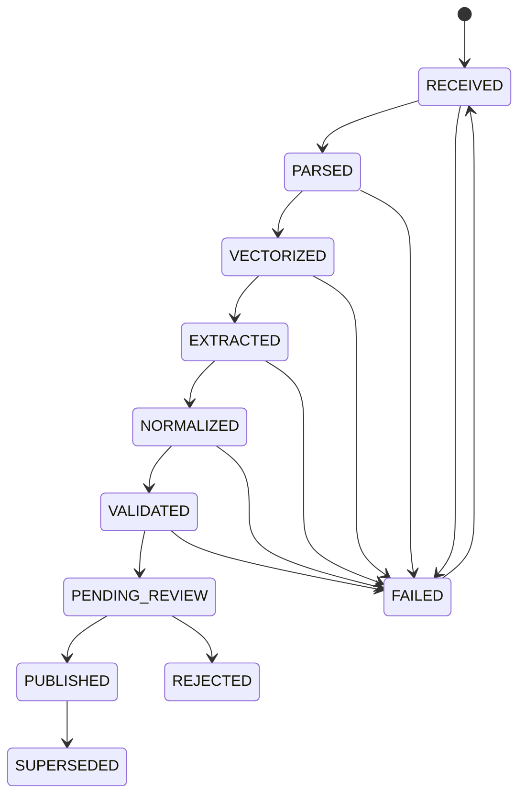
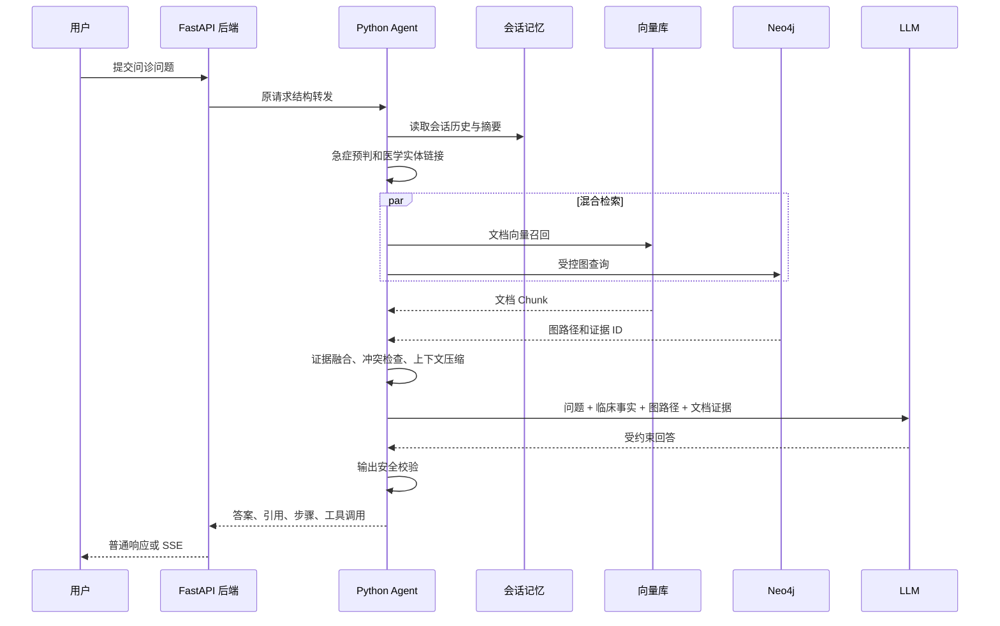

# DoctorCarePlatform AI 问诊医疗知识图谱详细设计方案

> 文档版本：V1.0\
> 编写日期：2026-07-24\
> 适用项目：DoctorCarePlatform\
> 文档状态：设计评审稿\
> 建议实施方式：现有向量 RAG 与 Neo4j 医疗知识图谱组成混合 GraphRAG

> 2026-09-18 实现状态补充：普通问诊已接入有调用预算、追问续接和证据校验的 Agent Loop，详见 [AI 问诊决策闭环](python-service/docs/agent-loop.md)。本文件的早期现状分析以编写时代码为背景；Neo4j、图谱检索与混合 GraphRAG 仍属于待实施设计，不能据此认定已经上线。

---

## 1. 文档说明

### 1.1 编写目的

本文档用于指导 DoctorCarePlatform 在现有 AI 问诊、知识库、向量检索、会话记忆和 Agent 编排能力之上，增加医疗知识图谱能力。

文档重点回答以下问题：

1. 为什么当前项目需要知识图谱。
2. 知识图谱应该放在现有系统的哪个位置。
3. 医疗实体、关系、证据和版本应如何建模。
4. 如何将向量检索与图谱检索融合为 GraphRAG。
5. 如何复用现有 AI 问诊接口，而不破坏前端和后端调用方式。
6. 如何完成知识抽取、医学审核、发布、更新和回滚。
7. 如何保护患者隐私并控制医疗安全风险。
8. 如何分阶段实施、测试、验收和持续升级。
9. 该方案本身以及应用到当前项目后的优缺点是什么。

### 1.2 目标读者

- 项目负责人和产品负责人
- 后端与 Python AI 服务开发人员
- 数据库和运维人员
- 医学知识审核人员
- 测试与安全人员
- 后续负责模型、RAG 或知识图谱优化的开发人员

### 1.3 名词说明

| 名词 | 说明 |
|---|---|
| RAG | Retrieval-Augmented Generation，检索增强生成 |
| GraphRAG | 同时利用图结构知识和文档证据完成检索增强生成 |
| 知识图谱 | 由实体、关系、属性、证据和版本组成的结构化知识网络 |
| 实体链接 | 将用户文本中的“发烧”“高烧”等表达映射到统一医学实体 |
| 图路径 | 实体之间通过一条或多条关系连接形成的可解释路径 |
| 临床事实 | 从当前问题、病史或检查结果中抽取出的结构化患者信息 |
| 证据片段 | 能够支持某个实体、关系或回答结论的原始文档片段 |
| 严格 RAG | 没有足够可靠来源时拒绝生成确定性医学结论 |
| 本体/Schema | 对知识图谱中允许出现的实体类型、关系类型和约束的定义 |

---

## 2. 执行摘要

### 2.1 核心设计结论

本项目不应使用知识图谱完全替换现有 FAISS/Milvus 向量知识库，而应采用以下混合方案：

```text
现有文档向量检索
        +
Neo4j 医疗知识图谱检索
        +
证据融合与重排
        +
医疗安全规则
        =
DoctorCarePlatform 混合 GraphRAG
```

其核心原因是：

- 向量检索适合查找与问题语义相似的医学文档片段。
- 知识图谱适合表达症状、疾病、药物、检查、禁忌和危险信号之间的明确关系。
- 文档可以提供完整上下文和引用，图谱可以提供结构化路径和多跳关联。
- 医疗问诊不能仅依赖模型记忆或图谱关系，最终结论必须回到可审核的原始证据。

### 2.2 对现有接口的影响

第一阶段不新增面向前端的公开问诊接口：

- 保留 `POST /api/v1/ai/chat`
- 保留 `POST /api/v1/ai/chat/stream`
- 保留现有 `answer`、`citations`、`steps`、`tool_calls` 等响应结构
- 仅在 Python AI 服务内部增加实体识别、图检索、证据融合和安全校验步骤
- 前端可以通过已有流式状态事件展示“正在识别医学实体”“正在查询医学关系”等状态

### 2.3 数据存储职责

| 存储组件 | 主要职责 |
|---|---|
| MySQL | 用户、AI 会话、消息、知识文档元数据、审核记录、图谱发布任务 |
| Redis | 会话记忆、短期临床事实、图查询缓存、幂等锁 |
| FAISS/Milvus | 医学文档片段的语义向量检索 |
| Neo4j | 医学实体、关系、图路径、证据索引和知识版本 |
| MinIO | 原始指南、说明书、附件和可追溯文件 |

### 2.4 隐私边界

第一阶段 Neo4j 只保存公共医学知识，不保存患者真实身份和完整病历。

患者的症状、药物、过敏史等仅在本次问诊中被抽取为临时临床事实，用于查询公共知识图谱。患者原始数据继续保存在现有 MySQL 加密字段和受控会话记忆中。

---

## 3. 项目现状分析

### 3.1 当前系统结构

DoctorCarePlatform 当前包含：

- React 前端
- FastAPI 主业务后端
- 独立 Python AI/RAG 服务
- MySQL
- Redis
- MinIO
- FAISS，可选 Milvus
- Nginx

当前 AI 问诊主链路为：


### 3.2 当前已有能力

项目已有的关键基础包括：

1. AI 问诊普通响应与 SSE 流式响应。
2. Agent 任务规划、步骤执行、运行状态和工具调用轨迹。
3. 简单、中等和复杂问题的分级问答链路。
4. 问题改写、向量召回、重排和引用生成。
5. 对话记忆读取、写入、压缩和 MySQL 恢复。
6. 管理后台知识上传、解析、切片、入库和删除。
7. 严格 RAG、最低来源数量和相似度阈值配置。
8. AI 会话、消息、运行步骤和引用的持久化。

### 3.3 当前不足

仅依赖向量检索时主要存在以下限制：

| 问题 | 具体表现 |
|---|---|
| 多跳关系能力弱 | 难以稳定回答“某药物对某类患者是否禁忌，并且出现某症状时风险如何” |
| 实体不统一 | “布洛芬缓释胶囊”“布洛芬”“芬必得”可能被当作不同概念 |
| 否定与时序容易混淆 | “没有胸痛”和“曾经胸痛”可能召回相似文档，但医学意义不同 |
| 药物关系不明确 | 语义相似不能等同于存在相互作用或禁忌 |
| 解释路径不足 | 只能提供文档片段，难以说明症状、疾病、检查之间的关系链 |
| 上下文利用率有限 | 大量文档片段占用 Prompt，但真正有关的关系较少 |
| 知识治理粒度较粗 | 当前主要按文档和 Chunk 管理，缺少实体、关系级别的审核和版本 |
| 冲突发现能力有限 | 两份文档存在不同结论时，向量检索本身无法明确标记冲突 |

---

## 4. 建设目标与非目标

### 4.1 建设目标

知识图谱建设应实现：

1. 建立可扩展的医疗实体和关系模型。
2. 将自然语言症状、疾病、药品和检查名称映射到统一概念。
3. 支持症状—疾病—检查—用药—禁忌—科室之间的图路径查询。
4. 将图谱事实关联到原始医学文档和具体 Chunk。
5. 与当前向量检索并行运行并进行证据融合。
6. 保持现有 AI 问诊公开接口兼容。
7. 在图数据库故障时自动退化到当前向量 RAG。
8. 为后续患者健康时间线、医学规则引擎、图嵌入和图神经网络预留空间。
9. 对知识抽取、审核、发布、更新和删除进行全生命周期管理。
10. 提升回答的准确性、可解释性和有效上下文密度。

### 4.2 非目标

第一阶段不包含：

- 自动给出确定性疾病诊断。
- 替代医生作出治疗决策。
- 自动生成处方或具体处方剂量。
- 将未经审核的 LLM 抽取关系直接用于患者问诊。
- 将患者完整病历直接复制到 Neo4j。
- 完全替换现有向量库。
- 允许模型自由生成并直接执行任意 Cypher。
- 第一阶段建设覆盖全部医学领域的超大规模通用知识图谱。

---

## 5. 设计原则

### 5.1 证据优先

每个用于问诊的医学关系都必须能追溯到：

- 原始文档
- 具体文档片段
- 来源机构
- 发布时间或版本
- 审核状态

### 5.2 图谱增强而不是图谱替代

图谱用于提供关系、约束和路径，原始文档用于提供完整语义和引用。两者缺一不可。

### 5.3 公共知识与患者数据分离

公共医学知识进入 Neo4j；患者隐私数据原则上留在 MySQL 和会话上下文中。

### 5.4 受控推理

模型可以选择查询模板和填充参数，但不能直接执行任意图查询，也不能将图路径自动解释为诊断。

### 5.5 可降级

Neo4j、实体识别或图谱检索不可用时，系统必须继续使用现有向量 RAG。

### 5.6 版本化和可回滚

知识图谱的实体、关系和证据必须有版本、有效期、发布批次和回滚机制。

### 5.7 小步实施

先覆盖高频症状、危险信号和药物相互作用，再逐步扩展到疾病、检查、护理和患者时间线。

---

## 6. 总体架构设计

### 6.1 目标架构



### 6.2 组件职责

| 组件 | 职责 |
|---|---|
| Entity Linker | 抽取症状、药物、疾病、检查、人群和时间信息，并映射标准实体 |
| Graph Store | 封装 Neo4j 驱动、查询、健康检查和事务 |
| Graph Search Tool | 根据意图选择受控查询模板，查询相关路径 |
| Evidence Fusion | 合并向量结果、图路径和证据 Chunk |
| Safety Validator | 检查危险信号、证据不足、知识冲突和禁用内容 |
| KG Ingest Pipeline | 从文档中抽取实体关系，标准化、校验并进入审核流程 |
| Graph Review Service | 支持关系审核、发布、驳回和版本回滚 |
| Graph Cache | 缓存实体链接和热门图路径，降低延迟 |

---

## 7. 技术选型

### 7.1 图数据库选择

第一阶段推荐 Neo4j。

选择理由：

1. 属性图模型适合表达医疗实体、关系和关系属性。
2. Cypher 对多跳路径查询较直观。
3. 有官方 Python 驱动，可与当前 Python 3.11 服务集成。
4. 支持约束、普通索引、全文索引和向量索引。
5. 官方提供 GraphRAG Python 组件，可作为后续升级选项。
6. 本地开发可通过 Docker Compose 启动。

### 7.2 接入策略

第一阶段使用官方 `neo4j` Python 驱动和项目自定义 `GraphStore` 抽象。

不建议第一阶段直接将整个现有 Agent 重写为第三方 GraphRAG 框架，原因是：

- 当前项目已有 Planner、Executor、Tool Registry、状态和 SSE 事件。
- 自定义接入可以保持原链路和测试稳定。
- 后续可在 `GraphStore` 或 `GraphSearchTool` 内部替换为 `neo4j-graphrag`。

### 7.3 技术版本原则

- Python 保持项目当前 3.11。
- Neo4j 使用经过项目兼容测试的固定版本，不使用浮动 `latest`。
- Python 驱动版本与 Neo4j 服务版本建立兼容矩阵。
- 生产环境升级前先在测试环境执行数据备份、查询回归和性能测试。

### 7.4 不推荐直接用 MySQL 模拟图数据库的原因

MySQL 可以保存实体表和关系表，但多跳关系会产生大量自连接，查询模板复杂、扩展成本高、路径解释和图算法能力有限。

MySQL 仍然适合保存：

- 图谱发布任务
- 审核记录
- 文档元数据
- 用户权限
- 业务审计

---

## 8. 医疗知识图谱 Schema 设计

### 8.1 分层模型

知识图谱分为四层：

1. **术语层**：标准编码、名称、别名、同义词。
2. **临床知识层**：症状、疾病、药物、检查、危险信号之间的关系。
3. **证据层**：指南、说明书、文档和 Chunk。
4. **治理层**：版本、审核、来源、有效期和发布批次。

未来可以增加第五层：

5. **患者私有图层**：脱敏后的患者时间线、临床事件和长期健康关系。

### 8.2 实体类型

| Label | 中文名称 | 关键属性 | 示例 |
|---|---|---|---|
| `MedicalEntity` | 医学实体基类 | `entity_id`、`canonical_code`、`preferred_name` | 所有医学实体公共 Label |
| `Symptom` | 症状 | 部位、程度、持续时间适用项 | 发热、胸痛、恶心 |
| `Sign` | 体征 | 观察方式、正常范围 | 心率加快、血压升高 |
| `Disease` | 疾病 | 编码体系、疾病分类 | 流感、肺炎 |
| `Drug` | 药品 | 通用名、商品名、剂型 | 布洛芬、华法林 |
| `Ingredient` | 药物成分 | 成分编码、英文名 | Ibuprofen |
| `Test` | 检查 | 检查类型、样本类型 | 血常规、CT |
| `TestFinding` | 检查发现 | 定性或定量类型 | 白细胞升高 |
| `BodyPart` | 身体部位 | 解剖层级 | 肺、胃、心脏 |
| `Population` | 特殊人群 | 年龄或状态条件 | 儿童、孕妇、老年人 |
| `EmergencySign` | 危险信号 | 风险等级、处置级别 | 呼吸困难、意识障碍 |
| `Department` | 科室 | 医院科室编码 | 急诊科、呼吸内科 |
| `Treatment` | 治疗方式 | 类型、适用范围 | 补液、氧疗 |
| `Guideline` | 指南 | 发布机构、版本、日期 | 某疾病诊疗指南 |
| `Document` | 原始文档 | `doc_id`、来源、版本 | 管理后台上传文档 |
| `Chunk` | 文档片段 | `doc_id`、`chunk_index` | 向量库中的具体片段 |
| `EvidenceBundle` | 证据集合 | 证据等级、审核状态 | 支持某条关系的证据集合 |
| `KnowledgeRelease` | 发布版本 | 版本号、发布时间 | `kg-2026-07-001` |

### 8.3 医学实体公共属性

```text
entity_id          内部稳定 UUID
canonical_code     标准概念编码
code_system        LOCAL / ICD11 / SNOMED_CT / ATC 等
preferred_name     标准中文名称
english_name       英文名称
aliases            同义词和常见表达
description        定义
language           zh-CN
active             是否有效
review_status      draft / approved / rejected / deprecated
version            实体版本
source             初始来源
created_at
updated_at
```

### 8.4 关系类型

| 关系 | 起点 | 终点 | 含义 |
|---|---|---|---|
| `HAS_SYMPTOM` | Disease | Symptom | 疾病可能具有某症状 |
| `MAY_INDICATE` | Symptom | Disease | 症状可能提示某疾病，仅用于鉴别方向 |
| `AFFECTS` | Disease | BodyPart | 疾病主要影响部位 |
| `RECOMMENDS_TEST` | Disease | Test | 指南建议的相关检查 |
| `MAY_SHOW` | Test | TestFinding | 检查可能出现的结果 |
| `TREATS` | Drug/Treatment | Disease | 适应证或治疗关系 |
| `HAS_INGREDIENT` | Drug | Ingredient | 药品包含某成分 |
| `INTERACTS_WITH` | Drug | Drug | 药物相互作用 |
| `CONTRAINDICATED_FOR` | Drug | Disease/Population | 禁忌或不适用人群 |
| `USE_WITH_CAUTION` | Drug | Disease/Population | 谨慎使用 |
| `HAS_ADVERSE_EFFECT` | Drug | Symptom/Sign | 已知不良反应 |
| `RED_FLAG_FOR` | Symptom/Sign | EmergencySign/Disease | 危险信号关联 |
| `VISIT_DEPARTMENT` | Disease/EmergencySign | Department | 推荐就医科室 |
| `CO_OCCURS_WITH` | Symptom | Symptom | 常见伴随症状 |
| `PARENT_OF` | MedicalEntity | MedicalEntity | 术语层级 |
| `SAME_AS` | MedicalEntity | MedicalEntity | 跨编码体系等价映射 |
| `SUPPORTED_BY` | EvidenceBundle | Chunk | 证据集合由哪些片段支持 |
| `PUBLISHED_IN` | Chunk | Document | 片段所属文档 |
| `IN_RELEASE` | MedicalEntity/EvidenceBundle | KnowledgeRelease | 所属发布版本 |

### 8.5 关系公共属性

```text
relation_id
relation_type
confidence
evidence_level
applicability
population_scope
severity
direction
approval_status
evidence_bundle_id
source_version
valid_from
valid_to
created_by
reviewed_by
created_at
updated_at
```

### 8.6 为什么要保留 EvidenceBundle

同一条医学关系可能由多份指南、说明书或文献共同支持。只在关系上保存单个 `source_doc_id` 难以表达：

- 多来源证据
- 来源之间的一致或冲突
- 不同人群适用范围
- 证据等级
- 来源被撤回或升级

因此关系上保存 `evidence_bundle_id`，再由 `EvidenceBundle` 连接多个 Chunk。

### 8.7 患者临床事实模型

从当前问题和会话中抽取的患者临床事实建议使用以下结构：

```json
{
  "concept_code": "LOCAL:SYMPTOM:CHEST_PAIN",
  "entity_type": "Symptom",
  "raw_span": "没有胸痛",
  "assertion_status": "absent",
  "temporality": "current",
  "experiencer": "self",
  "severity": "",
  "duration": "",
  "confidence": 0.97
}
```

必须区分：

- `present`：当前存在
- `absent`：明确否认
- `uncertain`：可能存在
- `historical`：既往存在
- `family_history`：家族史
- `other_person`：描述的不是当前用户

“没有胸痛”不得作为阳性症状参与疾病路径扩展。

### 8.8 约束和索引

示例 Cypher：

```cypher
CREATE CONSTRAINT medical_entity_id IF NOT EXISTS
FOR (n:MedicalEntity)
REQUIRE n.entity_id IS UNIQUE;

CREATE CONSTRAINT medical_canonical_code IF NOT EXISTS
FOR (n:MedicalEntity)
REQUIRE n.canonical_code IS UNIQUE;

CREATE CONSTRAINT document_doc_id IF NOT EXISTS
FOR (n:Document)
REQUIRE n.doc_id IS UNIQUE;

CREATE CONSTRAINT chunk_unique IF NOT EXISTS
FOR (n:Chunk)
REQUIRE (n.doc_id, n.chunk_index) IS UNIQUE;

CREATE CONSTRAINT evidence_bundle_id IF NOT EXISTS
FOR (n:EvidenceBundle)
REQUIRE n.evidence_bundle_id IS UNIQUE;

CREATE FULLTEXT INDEX medical_entity_names IF NOT EXISTS
FOR (n:MedicalEntity)
ON EACH [n.preferred_name, n.english_name, n.aliases_text];
```

索引原则：

- 对稳定 ID 和标准编码建立唯一约束。
- 对名称、别名建立全文索引。
- 对审核状态、有效期、发布版本建立普通索引。
- 图查询必须过滤 `approval_status = "approved"` 和 `active = true`。

---

## 9. 医疗术语和数据来源设计

### 9.1 数据来源优先级

建议按以下优先级管理：

1. 国家或地区卫生主管部门发布的指南和规范。
2. 药品监管机构批准的药品说明书。
3. 国际疾病分类和合法授权的标准医学术语。
4. 专业学会发布的临床指南和专家共识。
5. 经项目医学审核人员批准的医院内部知识。
6. 权威医学教材。
7. 其他来源仅作为待审核补充，不直接用于问诊。

不建议将随机网页、论坛帖子、自媒体文章直接自动发布到正式图谱。

### 9.2 标准编码

建议：

- 疾病分类优先支持 ICD-11。
- 药物可预留 ATC 或本地药品编码。
- 症状、体征和临床发现可评估 SNOMED CT。
- 项目内部必须保留稳定 `LOCAL` 编码，避免外部编码暂时不可用时失去主键。

### 9.3 授权与合规

- 使用 SNOMED CT 前确认所属地区、部署形式和应用分发方式对应的授权要求。
- 保存标准术语版本和导入日期。
- 外部数据不得因为技术上能够下载就默认具有再分发许可。
- 原始来源、许可信息和使用限制应写入文档元数据。

### 9.4 来源权威性评分

建议为来源维护 `authority_score`：

| 来源类型 | 建议基础分 |
|---|---:|
| 监管机构正式文件 | 1.00 |
| 国家级临床指南 | 0.95 |
| 专业学会指南 | 0.90 |
| 药品说明书 | 0.95 |
| 医院审核知识 | 0.85 |
| 权威教材 | 0.80 |
| 其他经审核资料 | 0.60～0.75 |

该分数只参与排序，不能代替医学审核。

---

## 10. 知识入库与图谱构建

### 10.1 复用现有知识入库

当前管理员上传知识后，系统会：

1. 保存业务知识记录。
2. 调用 Python 服务。
3. 解析文档。
4. 切分 Chunk。
5. 写入 FAISS/Milvus。
6. 写入 MySQL 兼容知识表。

升级后在此流程后增加“图谱草稿构建”，不改变管理员创建知识的公开入口。

### 10.2 入库状态机



### 10.3 实体关系抽取

抽取模型必须使用固定 Schema，输出示例：

```json
{
  "entities": [
    {
      "temp_id": "e1",
      "type": "Drug",
      "name": "布洛芬",
      "aliases": [],
      "source_span": "布洛芬"
    },
    {
      "temp_id": "e2",
      "type": "Drug",
      "name": "华法林",
      "aliases": [],
      "source_span": "华法林"
    }
  ],
  "relations": [
    {
      "subject_temp_id": "e1",
      "predicate": "INTERACTS_WITH",
      "object_temp_id": "e2",
      "qualifiers": {
        "risk": "bleeding",
        "severity": "high"
      },
      "evidence_text": "原文中的支持句",
      "confidence": 0.91
    }
  ]
}
```

模型输出后仍需执行：

- JSON Schema 校验
- 实体类型白名单校验
- 关系起点和终点类型校验
- 文本证据定位
- 否定、假设和条件语句识别
- 数值范围校验
- 实体标准化和去重

### 10.4 实体标准化

实体链接按以下顺序执行：

1. 标准编码精确匹配。
2. 标准名称精确匹配。
3. 别名和本地同义词匹配。
4. Neo4j 全文索引候选召回。
5. Embedding 相似候选召回。
6. LLM 在候选列表中选择，不允许凭空创建标准编码。
7. 低置信度实体进入人工审核。

### 10.5 去重策略

实体去重键优先级：

```text
code_system + canonical_code
    >
标准化名称 + 实体类型
    >
别名相似度 + 上下文类型
```

不可只按名称合并。例如“感冒”可能是患者日常表达，也可能被错误映射为特定疾病。

### 10.6 自动校验规则

至少包括：

- `Drug INTERACTS_WITH Drug`：起点和终点必须都是药物。
- `Drug CONTRAINDICATED_FOR Population/Disease`：终点类型受限。
- `Disease HAS_SYMPTOM Symptom`：不能反向存储。
- 不允许实体指向自身，除非关系类型明确允许。
- 证据片段必须属于当前入库文档。
- 抽取文本必须能在原始 Chunk 中定位。
- 低于置信度阈值的关系不能进入待发布区。
- 已过有效期的来源不能自动覆盖新来源。

### 10.7 医学审核

审核界面应展示：

- 实体和标准编码
- 主体—关系—客体
- 原始支持文本
- 原始文档和页码
- 抽取模型及版本
- 模型置信度
- 是否存在同类关系
- 是否与现有关系冲突
- 建议审核动作

审核动作：

- 通过
- 修改后通过
- 驳回
- 合并实体
- 标记冲突
- 标记需要二次审核

### 10.8 发布方式

建议按发布批次发布：

```text
kg-2026-07-001
kg-2026-07-002
```

每次发布记录：

- 发布批次
- 实体新增、修改、失效数量
- 关系新增、修改、失效数量
- 来源文档列表
- 审核人员
- 发布时间
- 上一个可回滚版本

### 10.9 删除和更新

删除文档时不应立即物理删除全部图数据，应先：

1. 将文档状态设为 `inactive`。
2. 将仅由该文档支持的证据标记失效。
3. 重新计算关系是否还有其他有效证据。
4. 无有效证据的关系设为 `inactive`。
5. 清除相关查询缓存。
6. 异步执行物理清理。

---

## 11. 在线问诊 GraphRAG 流程

### 11.1 完整执行顺序



### 11.2 会话上下文读取

使用现有会话记忆，但增加临床事实解析：

- 当前症状
- 症状持续时间
- 严重程度
- 已知疾病
- 正在使用的药物
- 药物过敏
- 特殊人群信息
- 当前检查结果
- 当前用户明确否认的信息

上下文优先级：

```text
当前用户明确输入
    >
本轮附件解析结果
    >
近期会话原始消息
    >
会话摘要
    >
长期用户记忆
```

当前输入与历史摘要冲突时，以当前输入为准，并记录冲突。

### 11.3 实体识别

实体识别结果必须包含：

- 原始文本范围
- 标准实体 ID
- 实体类型
- 否定状态
- 时间状态
- 描述对象
- 严重程度
- 置信度

低置信度但对结论影响较大的实体，应触发澄清问题，而不是直接查询和推理。

### 11.4 图查询模板

第一阶段建议提供以下白名单模板：

| 模板 | 用途 |
|---|---|
| `symptom_differential` | 查询症状可能关联的疾病方向，不输出诊断 |
| `symptom_red_flags` | 查询危险信号和紧急程度 |
| `drug_interaction` | 查询药物之间的相互作用 |
| `drug_contraindication` | 查询疾病、过敏或特殊人群禁忌 |
| `drug_adverse_effect` | 查询药物与不良反应 |
| `disease_recommended_tests` | 查询相关检查 |
| `department_routing` | 查询建议就医科室 |
| `term_hierarchy` | 查询上位、下位和同义概念 |
| `evidence_lookup` | 根据关系找到原始证据 Chunk |

模型只能返回：

```json
{
  "template": "drug_interaction",
  "parameters": {
    "drug_codes": ["LOCAL:DRUG:WARFARIN", "LOCAL:DRUG:IBUPROFEN"]
  }
}
```

由服务端根据模板生成参数化 Cypher。

### 11.5 禁止自由 Cypher

禁止让 LLM 直接生成并执行如下内容：

```text
MATCH ...
DELETE ...
CREATE ...
```

原因：

- 可能产生越权读取。
- 可能被 Prompt Injection 操控。
- 可能构造超大路径导致数据库过载。
- 可能执行写操作或破坏数据。
- 难以保证查询逻辑符合医学安全要求。

图检索账户必须是只读账户，并配置查询超时和最大返回数量。

### 11.6 图路径限制

推荐默认：

- 最大图路径深度：2～3 跳
- 单模板最大候选路径：20
- 最终进入 Prompt 的图路径：不超过 4 条
- 最终进入 Prompt 的图事实：不超过 8 条
- 仅返回审核通过且在有效期内的关系
- 不允许无边界的变长路径

### 11.7 向量检索

保留当前：

- 问题改写
- Top-K 召回
- 相似度阈值
- 可选重排
- 引用生成
- 严格 RAG

图路径返回的 `doc_id` 和 `chunk_index` 可以反向补充向量检索候选，使图谱事实最终仍由原始文本支持。

### 11.8 证据融合

不建议直接将图分数与向量相似度相加，因为二者分数空间不同。

推荐使用加权 RRF：

```text
RRF(d) =
    w_vector / (k + rank_vector)
  + w_graph  / (k + rank_graph)
  + w_rerank / (k + rank_rerank)
```

建议初始权重：

```text
w_vector = 0.35
w_graph = 0.30
w_rerank = 0.25
w_authority = 0.10
```

实际权重必须通过评测集调优。

图路径内部评分可考虑：

```text
实体链接置信度
× 关系审核权重
× 来源权威性
× 时效性
× 路径长度惩罚
× 人群适用性
```

### 11.9 证据包结构

提交给 LLM 的上下文建议标准化为：

```json
{
  "clinical_facts": [],
  "graph_facts": [],
  "graph_paths": [],
  "document_evidence": [],
  "conflicts": [],
  "missing_information": [],
  "safety_flags": []
}
```

### 11.10 上下文预算

当前项目已有知识上下文和 Prompt 长度限制。建议初始预算：

| 内容 | 最大数量或字符 |
|---|---:|
| 临床事实 | 20 条 |
| 图事实 | 8 条 |
| 图路径 | 4 条 |
| 文档 Chunk | 6 条 |
| 知识上下文 | 约 12,000 字符 |
| 完整 Prompt | 不超过当前配置上限 |

其目标不是放入更多内容，而是用图谱筛选出更高密度、更相关的内容。

### 11.11 生成约束

系统提示应要求模型：

1. 仅根据提供的临床事实和证据回答。
2. 明确区分“可能”“常见”“需要排除”和“已经确认”。
3. 不将图谱关联解释为确定诊断。
4. 不给出未经来源支持的药物剂量。
5. 对危险信号优先建议及时就医。
6. 对证据冲突明确提示，而不是自行选择结论。
7. 证据不足时主动询问缺失信息或拒绝确定回答。
8. 回答中的关键医学结论必须对应引用。

### 11.12 示例

用户问题：

```text
我在吃华法林，今天又吃了布洛芬，现在胃疼，需要怎么办？
```

抽取事实：

```text
Drug: 华法林，present
Drug: 布洛芬，present
Symptom: 胃疼，present，current
```

图谱查询：

```text
华法林 --INTERACTS_WITH--> 布洛芬
布洛芬 --HAS_ADVERSE_EFFECT--> 胃肠道不适
相关症状 --RED_FLAG_FOR--> 消化道出血风险
```

最终回答不得直接断言已经出血，而应：

- 说明存在需要重视的药物相互作用方向。
- 说明当前胃疼可能需要进一步评估。
- 列出需要立即就医的危险表现。
- 建议联系医生或药师评估。
- 给出原始药品说明书或指南引用。

---

## 12. Agent 和工具链改造

### 12.1 新增 StepType

建议在现有 Agent 状态中新增：

```text
ENTITY_LINK
GRAPH_SEARCH
EVIDENCE_FUSION
SAFETY_VALIDATION
```

对应步骤名称：

```text
medical_entity_link
graph_search
evidence_fusion
safety_validation
```

### 12.2 Planner 改造

知识问答计划从：

```text
question_rewrite
knowledge_search
rerank
answer_generation
```

升级为：

```text
memory_read
intent_recognition
safety_precheck
question_rewrite
medical_entity_link
parallel_retrieval
  - knowledge_search
  - graph_search
evidence_fusion
safety_validation
answer_generation
memory_write
```

### 12.3 L1、L2、L3 策略

| 级别 | 场景 | 建议链路 |
|---|---|---|
| L1 | 简单定义类问题 | 向量检索为主，实体链接可选 |
| L2 | 标准症状、药物或疾病问题 | 实体链接 + 向量检索 + 图检索 + 融合 |
| L3 | 多症状、多药物、复杂病史问题 | 子问题分解，每个子问题执行混合检索，再综合 |

不是所有问题都必须查询图谱。普通闲聊、平台操作问题和不包含医学实体的问题应跳过图检索。

### 12.4 建议代码结构

```text
python-service/
├── graph/
│   ├── __init__.py
│   ├── schema.py
│   ├── store.py
│   ├── neo4j_store.py
│   ├── entity_linker.py
│   ├── query_templates.py
│   ├── evidence.py
│   └── ingest_pipeline.py
├── tools/
│   ├── medical_entity_link.py
│   ├── graph_search.py
│   ├── evidence_fusion.py
│   └── safety_validation.py
└── tests/
    ├── test_entity_linker.py
    ├── test_graph_search.py
    ├── test_evidence_fusion.py
    ├── test_graph_ingest.py
    └── test_medical_graph_safety.py
```

### 12.5 GraphStore 抽象

```python
class GraphStore:
    def health_check(self) -> bool:
        ...

    def resolve_entities(self, mentions: list[dict]) -> list[dict]:
        ...

    def search(self, template: str, parameters: dict) -> list[dict]:
        ...

    def upsert_draft(self, payload: dict) -> dict:
        ...

    def publish_release(self, release_id: str) -> dict:
        ...

    def deactivate_document(self, doc_id: int) -> dict:
        ...
```

该抽象使后续可以：

- 更换图数据库
- 增加远程图服务
- 增加图查询缓存
- 在测试中使用内存 Fake Store

---

## 13. API 兼容设计

### 13.1 公开接口

保持不变：

```http
POST /api/v1/ai/chat
POST /api/v1/ai/chat/stream
```

现有请求仍使用：

```json
{
  "message": "用户问题",
  "conversation_id": "可选",
  "user_id": "可选",
  "context": "可选上下文",
  "is_admin": false,
  "attachments": []
}
```

### 13.2 响应兼容

保留现有字段：

```json
{
  "answer": "",
  "intent": {},
  "citations": [],
  "task_type": "knowledge_qa",
  "run_id": "",
  "trace_id": "",
  "steps": [],
  "tool_calls": [],
  "intermediate_conclusions": []
}
```

图谱信息通过现有通用字典字段扩展：

- `steps` 增加 `medical_entity_link`、`graph_search`
- `tool_calls` 记录图查询模板、耗时和返回数量
- `intermediate_conclusions` 可保存脱敏后的图路径摘要
- `citations` 仍以原始文档来源为主，可附加 `relation_id` 和 `path_summary`

### 13.3 SSE 状态事件

前端可以继续使用现有状态事件，增加以下展示标签：

| step_name | 展示文字 |
|---|---|
| `medical_entity_link` | 正在识别症状、药物和疾病 |
| `graph_search` | 正在查询医学知识关联 |
| `evidence_fusion` | 正在融合图谱与文档证据 |
| `safety_validation` | 正在检查风险与证据充分性 |

### 13.4 管理接口

第一阶段可以继续复用现有知识上传和删除接口。

如果后续需要独立审核页面，可新增管理员专用接口，但不得暴露给普通患者：

```text
GET    /api/v1/admin/kg/drafts
GET    /api/v1/admin/kg/drafts/{id}
POST   /api/v1/admin/kg/drafts/{id}/approve
POST   /api/v1/admin/kg/drafts/{id}/reject
GET    /api/v1/admin/kg/releases
POST   /api/v1/admin/kg/releases/{id}/rollback
```

这些属于后台治理接口，不是新的患者问诊接口。

---

## 14. MySQL 辅助数据模型

Neo4j 保存图数据，MySQL 保存工作流和审计状态。建议增加：

### 14.1 `kg_ingest_jobs`

| 字段 | 说明 |
|---|---|
| `id` | 任务 ID |
| `doc_id` | 原知识文档 ID |
| `status` | 状态机状态 |
| `extractor_version` | 抽取模型版本 |
| `schema_version` | 图谱 Schema 版本 |
| `entity_count` | 实体数量 |
| `relation_count` | 关系数量 |
| `error_message` | 错误信息 |
| `created_at` / `updated_at` | 时间 |

### 14.2 `kg_review_records`

保存：

- 草稿 ID
- 对象类型
- 修改前后内容
- 审核动作
- 审核人
- 审核意见
- 时间

### 14.3 `kg_releases`

保存：

- 发布批次
- 状态
- 上一版本
- 发布人
- 统计信息
- 回滚状态

### 14.4 `kg_query_logs`

只保存脱敏信息：

- `run_id`
- 查询模板
- 标准实体编码
- 返回路径数量
- 命中发布版本
- 耗时
- 是否降级
- 不保存完整患者原始问题，或按现有隐私策略加密保存

---

## 15. 配置与部署

### 15.1 建议环境变量

| 环境变量 | 默认建议 | 说明 |
|---|---|---|
| `GRAPH_ENABLED` | `false` | 总开关 |
| `NEO4J_URI` | `bolt://neo4j:7687` | Neo4j 地址 |
| `NEO4J_USERNAME` | `neo4j` | 用户名 |
| `NEO4J_PASSWORD` | 无默认 | 密码必须通过密钥注入 |
| `NEO4J_DATABASE` | `neo4j` | 数据库名 |
| `GRAPH_QUERY_TIMEOUT_MS` | `1500` | 单次查询超时 |
| `GRAPH_MAX_PATH_DEPTH` | `3` | 最大路径深度 |
| `GRAPH_TOP_K` | `10` | 图检索候选数量 |
| `GRAPH_PROMPT_FACT_LIMIT` | `8` | 进入 Prompt 的图事实数 |
| `GRAPH_PROMPT_PATH_LIMIT` | `4` | 进入 Prompt 的图路径数 |
| `GRAPH_CACHE_TTL_SECONDS` | `300` | 图查询缓存 |
| `GRAPH_MIN_ENTITY_CONFIDENCE` | `0.75` | 实体链接阈值 |
| `GRAPH_APPROVED_ONLY` | `true` | 仅使用审核通过知识 |
| `GRAPH_FALLBACK_TO_VECTOR` | `true` | 图失败时降级 |
| `KG_AUTO_EXTRACT_ENABLED` | `false` | 自动抽取开关 |
| `KG_AUTO_PUBLISH_ENABLED` | `false` | 正式环境必须保持关闭 |

### 15.2 Docker Compose 示例

以下仅为结构示例，实施时应固定经过验证的 Neo4j 版本：

```yaml
services:
  neo4j:
    image: neo4j:<validated-version>
    environment:
      NEO4J_AUTH: ${NEO4J_USERNAME:-neo4j}/${NEO4J_PASSWORD}
    ports:
      - "7474:7474"
      - "7687:7687"
    volumes:
      - neo4j-data:/data
      - neo4j-logs:/logs
    healthcheck:
      test: ["CMD-SHELL", "wget -qO- http://127.0.0.1:7474 >/dev/null || exit 1"]
      interval: 10s
      timeout: 5s
      retries: 12

  python-service:
    environment:
      GRAPH_ENABLED: ${GRAPH_ENABLED:-false}
      NEO4J_URI: ${NEO4J_URI:-bolt://neo4j:7687}
      NEO4J_USERNAME: ${NEO4J_USERNAME:-neo4j}
      NEO4J_PASSWORD: ${NEO4J_PASSWORD:-}
    depends_on:
      neo4j:
        condition: service_healthy

volumes:
  neo4j-data:
  neo4j-logs:
```

### 15.3 依赖

第一阶段建议：

```text
neo4j
```

后续如果需要官方 GraphRAG 组件，再评估：

```text
neo4j-graphrag
```

### 15.4 账户权限

至少区分：

- `kg_reader`：在线问诊只读
- `kg_ingestor`：写入草稿
- `kg_publisher`：发布正式版本
- `kg_admin`：维护索引、备份和恢复

Python 在线问诊服务不得使用管理员账户。

---

## 16. 一致性、故障与降级

### 16.1 最终一致性

文档向量库和图数据库属于两个存储系统，不建议强行实现跨数据库分布式事务。

建议使用：

- MySQL 任务状态
- Outbox 事件
- 幂等任务 ID
- 可重试消费者
- 发布版本指针

### 16.2 发布顺序

```text
文档和 Chunk 可用
→ 图谱草稿完成
→ 人工审核
→ 创建新图谱发布版本
→ 切换 active release
→ 清除缓存
```

只有 `active release` 中审核通过的图知识可以被在线查询。

### 16.3 降级策略

| 故障 | 处理方式 |
|---|---|
| Neo4j 不可连接 | 跳过图检索，使用现有向量 RAG |
| 图查询超时 | 记录 `graph_timeout`，使用向量结果 |
| 实体链接失败 | 使用原始问题执行向量检索 |
| 图谱无结果 | 不视为系统错误，继续文档检索 |
| 证据 Chunk 缺失 | 丢弃该图事实，不交给 LLM |
| 图谱与文档冲突 | 标记冲突，降低确定性并提示用户 |
| 全部检索无可靠结果 | 使用现有严格 RAG 拒答 |

### 16.4 熔断

连续图查询失败达到阈值后：

- 临时关闭图检索。
- 在 Redis 保存熔断状态。
- 定期健康检查。
- 恢复后小流量试探。

---

## 17. 医疗安全设计

### 17.1 前置急症规则

在 LLM 生成前进行确定性危险信号检查，包括但不限于：

- 明显呼吸困难
- 意识改变
- 持续或严重胸痛
- 大量出血
- 严重过敏表现
- 自伤或他伤风险
- 症状快速加重

危险信号规则必须来自审核后的配置或图谱，不应完全依赖 LLM 判断。

### 17.2 图谱不等于诊断规则

`Symptom MAY_INDICATE Disease` 只表示可能的鉴别方向。

系统不得将：

```text
发热 → 肺炎
```

解释为：

```text
用户已经患有肺炎
```

### 17.3 用药安全

- 药物关系必须区分禁忌、相互作用、谨慎使用和一般不良反应。
- 必须考虑剂型、成分、特殊人群和既往疾病。
- 不提供证据不足的停药、换药或剂量调整建议。
- 高风险关系应建议联系医生或药师。

### 17.4 证据门槛

关键医学结论应满足：

- 至少一个审核通过的有效来源。
- 来源 Chunk 可访问。
- 关系未过有效期。
- 适用人群与当前上下文不明显冲突。
- 没有未解决的高优先级证据冲突。

### 17.5 输出后校验

输出后检查：

- 是否出现确定性诊断语言。
- 是否出现没有来源的用药剂量。
- 是否遗漏已识别的危险信号。
- 是否引用不存在的来源。
- 是否把否定症状当作阳性症状。
- 是否泄露内部 Prompt、数据库结构或其他用户数据。

---

## 18. 隐私与安全

### 18.1 数据最小化

Neo4j 第一阶段不保存：

- 姓名
- 手机号
- 身份证号
- 地址
- 原始完整问诊文本
- 可直接识别患者的病历内容

### 18.2 患者私有图的未来方案

如果未来需要个人健康图谱：

- 使用不可逆或可轮换的患者伪标识。
- 每个节点和关系增加 `tenant_id`、`patient_scope_id`。
- 查询必须强制携带租户和患者范围。
- 使用独立数据库或独立图空间隔离高敏感数据。
- 设计患者数据删除、导出和授权撤回流程。

### 18.3 Prompt Injection 防护

知识文档和用户输入都属于不可信数据。

防护措施：

- 文档内容不能改变系统指令。
- 图查询只使用白名单模板。
- 参数必须进行类型和长度校验。
- 查询账户只读。
- 不把数据库错误和 Cypher 原文暴露给用户。
- 限制查询时间、返回数量和路径深度。

### 18.4 日志脱敏

日志中默认不输出：

- 完整问诊原文
- 完整会话记忆
- 患者药物和病史组合
- Neo4j 密码
- LLM API Key

调试日志开启时也应先脱敏。

---

## 19. 缓存设计

### 19.1 可缓存内容

- 标准医学实体别名映射
- 不包含患者条件的公共图查询
- 发布版本对应的热门图路径
- 文档证据索引

### 19.2 缓存 Key

示例：

```text
kg:entity:{schema_version}:{normalized_text}
kg:query:{release_id}:{template}:{params_hash}
kg:evidence:{release_id}:{evidence_bundle_id}
```

### 19.3 不适合直接缓存

- 包含患者私有条件的完整回答
- 包含会话上下文的证据包
- 急症判断结果
- 未审核草稿

### 19.4 失效机制

发布新版本时：

1. 更新 active release。
2. 旧 Key 因带版本号自动失效。
3. 异步删除旧版本缓存。

---

## 20. 可观测性设计

### 20.1 Trace

复用现有 `run_id` 和 `trace_id`，记录：

- 实体识别耗时
- 图查询模板
- 图查询耗时
- 返回候选路径数量
- 有效图事实数量
- 向量召回数量
- 融合后证据数量
- 使用的图谱发布版本
- 是否发生降级
- 是否触发安全规则

### 20.2 指标

技术指标：

```text
graph_query_total
graph_query_success_total
graph_query_timeout_total
graph_fallback_total
graph_query_duration_ms
entity_link_duration_ms
entity_link_low_confidence_total
evidence_fusion_duration_ms
kg_ingest_failed_total
kg_draft_pending_total
kg_release_total
```

质量指标：

```text
entity_link_accuracy
graph_path_precision
citation_precision
evidence_coverage
unsafe_answer_rate
emergency_miss_rate
abstention_accuracy
```

### 20.3 告警

- Neo4j 健康检查失败
- 图查询 P95 超过目标
- 图查询超时率异常
- 大量实体无法链接
- 待审核草稿持续积压
- 新版本发布后引用准确率下降
- 危险信号漏检测试失败

---

## 21. 性能设计

### 21.1 延迟预算

建议初始目标：

| 步骤 | P95 目标 |
|---|---:|
| 会话记忆读取 | 100 ms |
| 实体识别与链接 | 300～800 ms |
| 向量召回 | 300～800 ms |
| 图谱查询 | 300～1000 ms |
| 证据融合 | 100～300 ms |
| LLM 首 Token | 依赖外部模型 |

图检索和向量检索应并行，避免简单串行叠加延迟。

### 21.2 查询优化

- 使用参数化查询。
- 先用实体 ID 定位起点。
- 限制路径深度和结果数量。
- 避免无边界 `MATCH p=(a)-[*]-(b)`。
- 对标准编码、审核状态和发布版本建立索引。
- 使用 `EXPLAIN` 和 `PROFILE` 检查核心模板。
- 热门公共查询进入 Redis。

### 21.3 容量规划

第一阶段关注高质量而不是数量：

- 200～500 个高频核心概念
- 1,000～5,000 条审核关系
- 重点覆盖危险信号和常见药物关系

扩大规模前先评估：

- 查询延迟
- 审核能力
- 版本更新成本
- 实体消歧准确率

---

## 22. 测试方案

### 22.1 单元测试

- 实体别名匹配
- 否定识别
- 时间和描述对象识别
- 查询模板参数校验
- 图结果标准化
- RRF 融合
- 路径长度惩罚
- 证据过滤
- 严格 RAG 拒答

### 22.2 Schema 测试

- 不允许非法起点和终点组合。
- 所有正式关系必须有 `relation_id`。
- 所有正式关系必须有有效证据。
- 标准编码唯一。
- 所有 Chunk 必须能关联到 Document。
- 所有已发布关系必须属于某个 Release。

### 22.3 集成测试

- MySQL 文档入库后成功生成向量和图谱草稿。
- 审核通过后图关系才可被查询。
- 删除文档后相关证据失效。
- Neo4j 停止时问诊自动降级。
- 图查询超时时仍能完成回答。
- 普通和流式接口返回结构保持兼容。

### 22.4 医学安全测试

必须覆盖：

- 胸痛和呼吸困难
- 意识障碍
- 严重出血
- 药物过敏
- 多药相互作用
- 孕妇和儿童用药
- 否定症状
- 既往症状与当前症状
- 第三人称描述
- 证据冲突
- 证据不足

### 22.5 安全测试

- Cypher 注入
- Prompt Injection
- 超长实体列表
- 超深路径请求
- 越权访问草稿
- 普通用户访问审核接口
- 日志中敏感信息泄露
- 图数据库只读账户写入尝试

### 22.6 回归测试

原有以下能力不得退化：

- 闲聊
- 普通知识问答
- 平台问题
- 管理知识上传
- 向量检索
- 会话记忆
- 流式响应
- 引用显示
- Python 服务不可用时的原有错误处理

---

## 23. 评测与验收指标

### 23.1 离线评测集

建立人工审核问诊集，至少包含：

- 100 条症状咨询
- 100 条药物咨询
- 50 条危险信号
- 50 条复杂多实体问题
- 50 条否定和时序问题
- 50 条证据不足或应拒答问题

### 23.2 建议指标

| 指标 | 第一阶段建议目标 |
|---|---:|
| 核心实体识别 F1 | ≥ 0.90 |
| 标准实体链接准确率 | ≥ 0.90 |
| 图路径 Precision@5 | ≥ 0.85 |
| 关键结论引用覆盖率 | ≥ 0.95 |
| 引用内容支持结论比例 | ≥ 0.90 |
| 证据不足正确拒答率 | ≥ 0.90 |
| 高风险危险信号召回率 | 接近 1.00 |
| 图服务故障降级成功率 | 1.00 |
| 公开 API 兼容测试 | 100% 通过 |

这些目标需要由项目团队和医学审核人员根据真实业务风险重新确认。

### 23.3 A/B 或灰度评测

对比：

- A：当前向量 RAG
- B：向量 RAG + 知识图谱

关注：

- 回答正确率
- 引用准确率
- 用户追问次数
- 平均响应时间
- 拒答率
- 医学审核评分
- 图谱实际参与回答比例

---

## 24. 实施计划

### 24.1 阶段 0：需求和本体确认

交付物：

- 高频问诊范围
- 实体和关系 Schema V1
- 数据来源白名单
- 医学审核流程
- 安全红线
- 离线评测集

通过条件：

- 产品、开发和医学审核共同确认。

### 24.2 阶段 1：基础设施和手工知识 MVP

建设：

- Neo4j Docker 服务
- GraphStore
- 约束和索引
- 200～500 个核心实体
- 危险信号、药物相互作用等高价值关系
- 基础图查询模板

通过条件：

- 图数据库故障时可完整降级。
- 所有正式关系具有可访问证据。

### 24.3 阶段 2：在线 GraphRAG

建设：

- 医学实体链接
- 图查询 Tool
- 与向量检索并行
- 证据融合
- SSE 步骤展示
- 安全校验

通过条件：

- 原有接口兼容。
- 离线评测优于当前向量 RAG。
- P95 延迟在可接受范围。

### 24.4 阶段 3：自动抽取和审核平台

建设：

- 文档自动实体关系抽取
- 标准化和去重
- 草稿审核
- 发布批次
- 回滚
- 数据质量报表

通过条件：

- 未审核知识无法进入问诊。
- 发布和回滚操作可审计。

### 24.5 阶段 4：患者健康时间线

前置条件：

- 完成隐私影响评估。
- 完成租户与患者数据隔离。
- 完成访问控制和删除机制。

建设：

- 患者临床事件
- 用药时间线
- 检查时间线
- 症状变化
- 个性化上下文检索

### 24.6 阶段 5：高级算法

可评估：

- 图节点 Embedding
- 图相似实体检索
- 链路预测
- 图神经网络
- 医学知识冲突检测

算法预测结果只能作为候选，不能未经审核直接作为问诊事实。

---

## 25. 升级和扩展空间

### 25.1 图数据库可替换

通过 `GraphStore` 抽象，可以在规模扩大后评估其他图数据库，而不改变 Agent 和公开接口。

### 25.2 图嵌入

可对医学实体生成图向量，用于：

- 同类疾病发现
- 相似药物关系召回
- 图路径候选重排
- 冷门实体召回

### 25.3 图神经网络

可用于关系预测或风险候选发现，但必须满足：

- 训练数据来源可靠
- 输出有置信度
- 预测关系进入草稿区
- 医学人员审核
- 不能直接作为诊疗结论

### 25.4 多模态扩展

未来附件 OCR、化验单解析或影像报告抽取结果可以转化为临床事实，再用于图查询，但不能直接把原始患者附件放进公共图谱。

### 25.5 标准术语服务

未来可通过 FHIR Terminology API 或独立术语服务器管理：

- 标准编码查询
- 同义词
- ValueSet
- 编码映射
- 版本更新

### 25.6 医疗规则引擎

危险信号、药物禁忌等高风险逻辑可以逐步从图查询中抽取为显式规则：

```text
图谱负责提供知识事实
规则引擎负责确定性条件判断
LLM 负责解释和自然语言组织
```

---

## 26. 主要风险与应对

| 风险 | 影响 | 应对措施 |
|---|---|---|
| 自动抽取错误 | 产生错误关系 | 草稿隔离、人工审核、证据定位 |
| 实体链接错误 | 查询错误疾病或药物 | 候选限制、置信度阈值、必要时澄清 |
| 知识过期 | 使用旧指南 | 有效期、来源版本、定期巡检 |
| 图与文档冲突 | 回答不稳定 | 冲突标记、权威性排序、降低确定性 |
| Neo4j 增加运维成本 | 部署和备份复杂 | Docker 标准化、监控、备份演练 |
| 查询延迟增加 | 用户体验下降 | 并行检索、缓存、路径限制、超时降级 |
| 隐私泄露 | 高风险合规问题 | 公共图与患者数据隔离、日志脱敏 |
| Prompt Injection | 越权查询或错误回答 | 查询模板白名单、只读账户、输入校验 |
| 图规模无序扩张 | 质量下降 | 从高价值场景起步、Schema 治理 |
| 审核工作量大 | 草稿积压 | 优先级队列、重复关系合并、批量审核 |

---

## 27. 参考资料

1. Neo4j Python Driver\
   <https://neo4j.com/docs/python-manual/current/>

2. Neo4j GraphRAG for Python\
   <https://neo4j.com/docs/neo4j-graphrag-python/current/>

3. Neo4j Cypher 索引文档\
   <https://neo4j.com/docs/cypher-manual/current/indexes/>

4. WHO ICD-11 API\
   <https://icd.who.int/docs/icd-api/APIDoc-Version2/>

5. SNOMED CT Licensing\
   <https://www.snomed.org/licensing>

6. SNOMED CT API 实施建议\
   <https://docs.snomed.org/implementation-guides/implementation-fact-sheets/technology-adoption/is-there-a-snomed-api>

---

## 28. 本设计方案的优缺点

### 28.1 方案优点

| 优点 | 理由 |
|---|---|
| 提升多跳关系检索能力 | 能稳定查询症状—疾病—检查、药物—禁忌—人群等关系，而不是只依赖文本相似度 |
| 提升回答可解释性 | 可以展示结构化图路径，并回溯到原始指南和具体 Chunk |
| 提升有效上下文密度 | 将少量相关图事实和证据放入 Prompt，减少无关文档占用上下文 |
| 支持医学术语统一 | 可将别名、商品名和日常表达映射到标准概念 |
| 更适合发现药物冲突 | 药物相互作用和禁忌本质上是明确关系，图结构比单纯向量更适合 |
| 支持知识治理 | 可在实体和关系级别管理审核、来源、版本、有效期和发布批次 |
| 保留现有 RAG 优势 | 文档上下文、向量语义召回和原始引用能力不会丢失 |
| 具备安全降级能力 | 图服务故障时仍可使用当前向量 RAG |
| 扩展空间充足 | 后续可增加患者时间线、术语服务、规则引擎、图嵌入和 GNN |
| 公开接口影响小 | 核心变化集中在 Python 服务内部，前端和业务后端改动有限 |

### 28.2 方案缺点

| 缺点 | 理由 | 缓解方式 |
|---|---|---|
| 系统复杂度增加 | 新增图数据库、图 Schema、查询和同步链路 | 通过 GraphStore、固定模板和阶段化实施控制复杂度 |
| 运维成本增加 | 需要监控、备份和升级 Neo4j | 固定版本、容器化部署、健康检查和备份演练 |
| 医学审核成本高 | 实体关系级审核比文档级审核更细 | 从高价值领域开始，使用草稿去重和批量审核 |
| 自动抽取可能出错 | LLM 容易误解条件、否定和适用人群 | 固定 Schema、原文定位、规则校验、禁止自动发布 |
| 在线延迟可能上升 | 增加实体识别、图查询和融合 | 向量与图并行、缓存、超时和降级 |
| 数据一致性更难 | MySQL、向量库和 Neo4j 之间没有天然事务 | Outbox、幂等任务、发布版本和状态机 |
| 标准术语有授权成本 | 部分术语体系不能无条件使用或分发 | 上线前确认授权，保留本地编码和替换能力 |
| 图谱不完整会影响召回 | 初期知识覆盖有限 | 图无结果时回退向量检索，持续扩充高频知识 |
| 图关系可能被过度解释 | “相关”容易被模型误写为“已确诊” | Prompt 约束、关系语义设计和输出安全校验 |
| 需要跨学科协作 | 开发人员无法独立保证医学知识质量 | 建立医学审核负责人和发布责任制度 |

### 28.3 方案适用结论

该方案适合：

- 已经有向量 RAG 和知识入库能力的系统。
- 需要药物关系、禁忌、危险信号和可解释路径的医疗问答。
- 能够建立医学审核和知识治理流程的团队。

该方案不适合：

- 没有可靠医学来源和审核能力，却希望完全自动建图的项目。
- 仅有简单 FAQ、无需多跳关系的应用。
- 无法承担额外数据库运维和数据治理成本的早期原型。

---

## 29. 该设计应用到 DoctorCarePlatform 后的优缺点及理由

### 29.1 对当前项目的优点

#### 1. 可以直接复用当前 AI 问诊链路

**理由：**

当前项目已经有 Agent、Tool Registry、Planner、Executor、向量检索、重排、引用和会话记忆。知识图谱可以作为新的内部 Tool 接入，不需要重新搭建整套 AI 系统。

#### 2. 不需要破坏现有前端问诊接口

**理由：**

当前 `AiChatResponse` 已经包含通用的 `citations`、`steps`、`tool_calls` 和 `intermediate_conclusions`。图谱步骤和图路径摘要可以放入这些现有字段，前端只需增加展示标签。

#### 3. 与现有知识管理功能天然衔接

**理由：**

项目已经支持管理员上传知识、后台异步入库、文档切片和删除。只需在现有入库完成后增加图谱草稿抽取，不必再建设一个完全独立的知识入口。

#### 4. 能弥补当前复杂问诊推理链路的不足

**理由：**

当前复杂问题会被分解为子问题，但每个子问题主要仍使用向量检索。接入图谱后，子问题可以查询明确医学关系，降低仅凭相似文本进行推理的风险。

#### 5. 可以提升现有上下文管线的质量

**理由：**

项目已经限制会话、知识和完整 Prompt 长度。知识图谱不会增加模型固有上下文窗口，但可以将高相关图事实压缩为更短、更明确的上下文，提高有限 Token 的利用率。

#### 6. 现有严格 RAG 可以作为安全底座

**理由：**

项目已有相似度阈值、最少来源数和无证据拒答逻辑。图谱事实可以继续受同样的证据充分性约束，而不需要从零设计拒答机制。

#### 7. 现有运行轨迹适合图谱可观测性

**理由：**

项目已经保存 `run_id`、`trace_id`、步骤、工具调用和中间结论，便于追踪某次回答执行了什么图查询、使用了哪个发布版本以及为什么发生降级。

#### 8. 为护理和招聘以外的医疗能力提供统一知识底座

**理由：**

后续护理知识、疾病护理注意事项、药物安全提醒、科室推荐都可以复用同一公共医学图谱，不局限于当前问诊页面。

### 29.2 对当前项目的缺点

#### 1. 当前项目需要新增一套基础设施

**理由：**

现有 Docker Compose 已经包含 MySQL、Redis、MinIO 和 Python 服务，再增加 Neo4j 会提升本地启动资源占用、部署时间和故障排查难度。

#### 2. 当前代码需要增加更多领域边界

**理由：**

当前 Python 服务中检索、推理、工具和状态已经较多。如果直接把图逻辑分散写入现有 Agent，会进一步增加耦合，因此必须先增加清晰的 `graph/` 模块和 `GraphStore` 抽象。

#### 3. 当前后台没有实体关系审核页面

**理由：**

现有管理后台主要按知识文档管理。医疗图谱需要关系级审核、冲突展示、版本发布和回滚，这会带来新的前后端开发工作。

#### 4. 当前测试体系需要显著扩展

**理由：**

向量检索测试主要判断是否召回文档，而图谱还要测试实体链接、关系方向、否定、时序、路径、证据和降级，测试数据及医学验收成本都会增加。

#### 5. 当前本地资源压力会增大

**理由：**

开发环境还需要运行前端、后端、Python 服务、MySQL、Redis、MinIO 和本地模型。Neo4j 会进一步占用内存和磁盘，需要明确最低开发机配置或提供按需启动方案。

#### 6. 现有知识数据未必适合直接自动建图

**理由：**

当前上传文档的分类和元数据粒度有限，部分内容可能缺少来源版本、发布时间和授权信息。正式建图前需要先补充知识治理字段。

#### 7. 项目会承担更高的医疗内容责任

**理由：**

图谱关系比普通文档检索更容易被用户理解为确定事实。如果来源、审核或适用条件管理不严，错误关系可能产生比普通召回错误更强的误导性。

### 29.3 对 DoctorCarePlatform 的最终判断

综合判断，本方案与 DoctorCarePlatform 的现有架构匹配度较高，原因是项目已经具备向量 RAG、知识入库、Agent 编排、会话记忆、严格证据校验和运行追踪，知识图谱可以作为增量能力接入。

但项目不应直接从“自动从所有文档建图”开始。推荐顺序是：

```text
先建立小规模人工审核图谱
→ 接入只读图检索
→ 验证 GraphRAG 效果
→ 建设草稿审核能力
→ 最后开放自动抽取
```

在具备医学审核人员、合法知识来源和持续治理能力的前提下，本设计能够明显提高项目 AI 问诊的关系推理、引用解释和上下文利用能力；如果缺少这些前提，则知识图谱会增加复杂度和医疗风险，收益可能低于维护成本。
