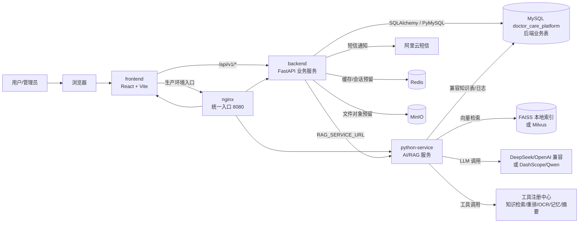
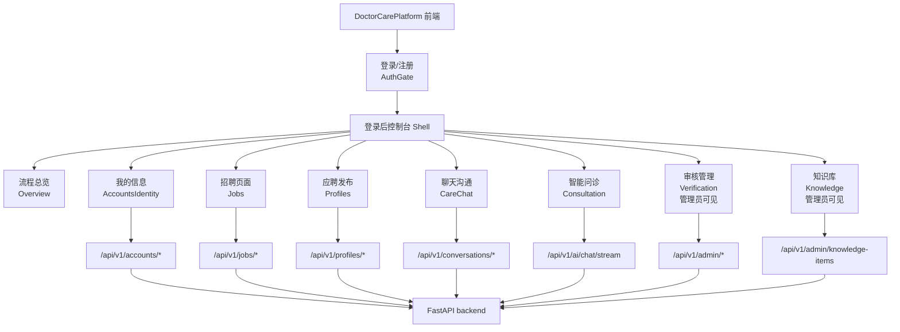
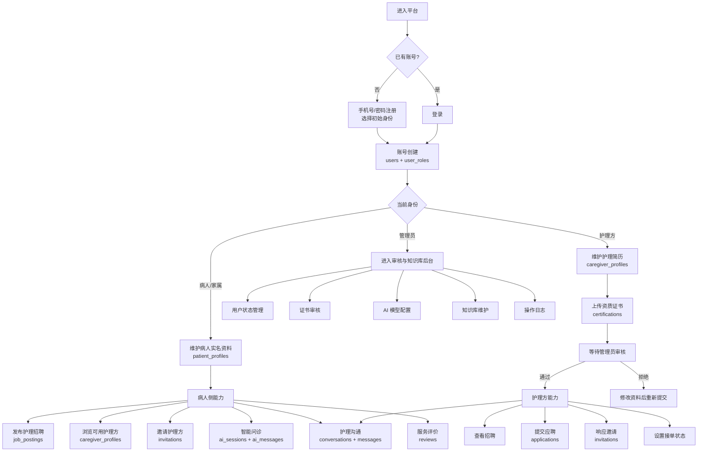
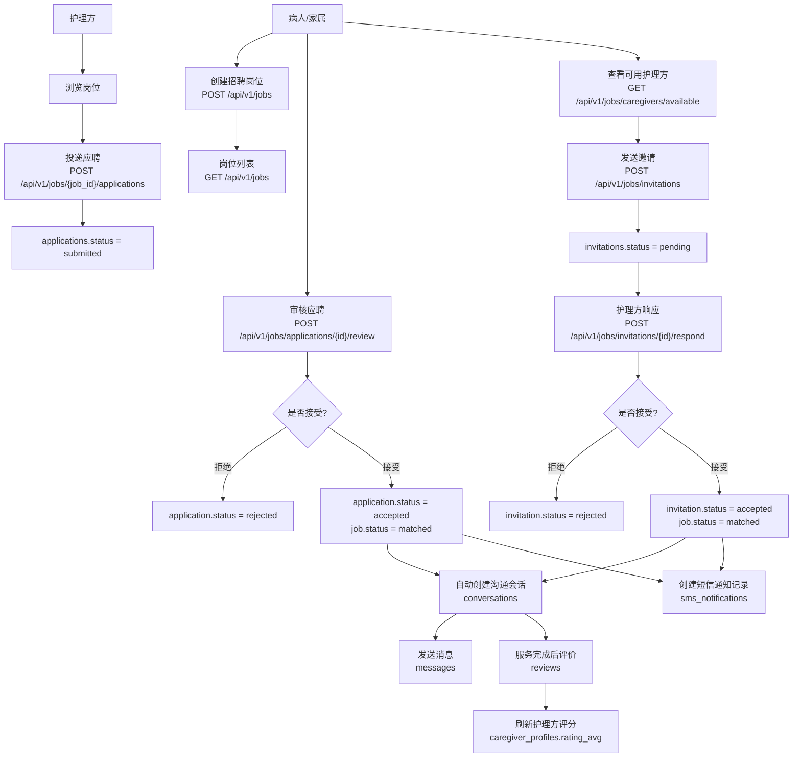
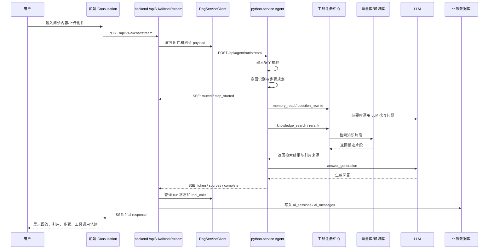
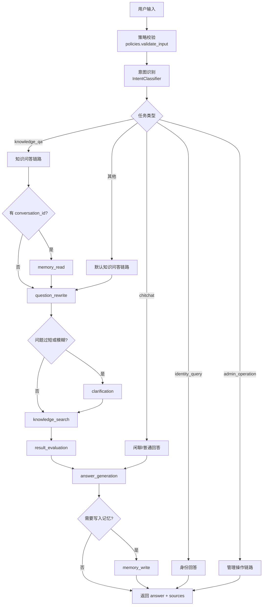
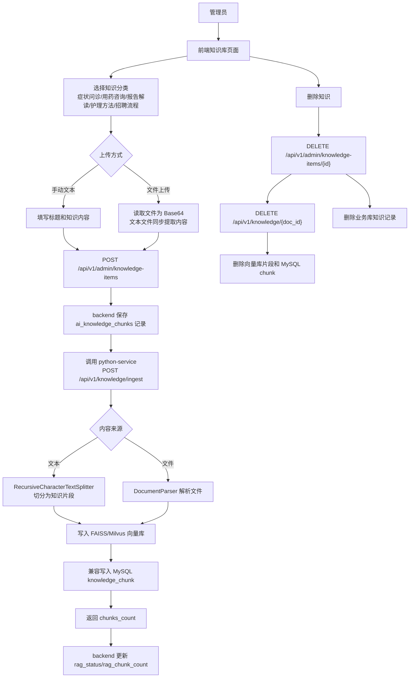
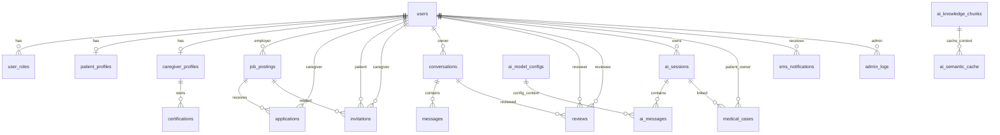
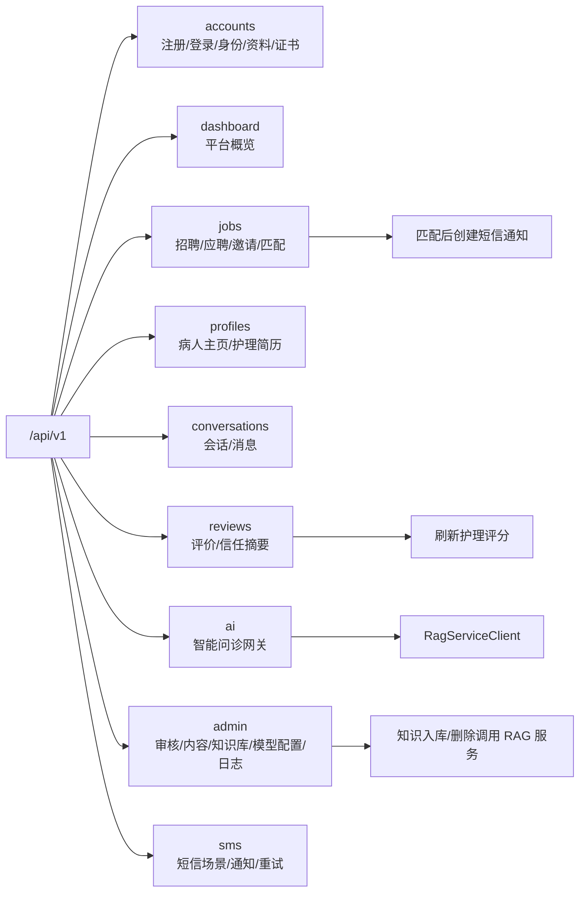
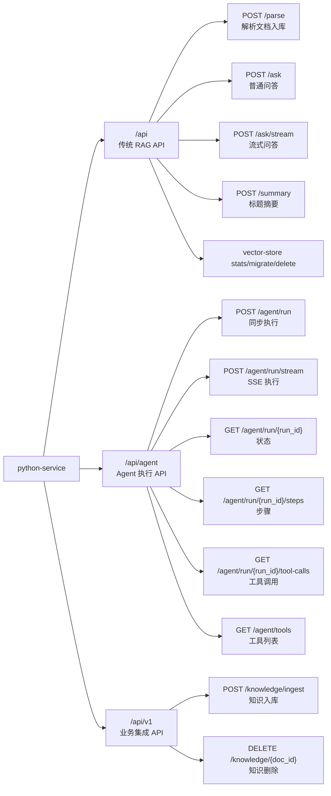

# DoctorCarePlatform 工作流程与功能构图

本文档根据当前项目代码整理，主要覆盖：

- `frontend`: React + TypeScript 控制台
- `backend`: FastAPI 主业务服务
- `python-service`: AI / RAG 智能问诊与知识库服务
- `infra`: Nginx、MySQL、Redis、MinIO 等基础设施

## 1. 系统总体架构

## 2. 前端功能构图

## 3. 用户身份与主业务流程

## 4. 护理招聘与匹配流程

## 5. 智能问诊处理流程

## 6. AI Agent 内部步骤图

## 7. 管理员知识库维护流程

## 8. 核心数据关系图

## 9. 后端 API 模块地图

## 10. python-service API 模块地图

## 11. 阅读建议

如果你想最快理解项目，可以按这个顺序看：

1. 先看“系统总体架构”，明确三个服务如何协作。
2. 再看“用户身份与主业务流程”，理解病人、护理方、管理员三类角色。
3. 接着看“护理招聘与匹配流程”，这是平台业务闭环。
4. 然后看“智能问诊处理流程”和“AI Agent 内部步骤图”，理解 AI 问诊链路。
5. 最后看“核心数据关系图”和 API 模块地图，回到代码时更容易定位文件。
