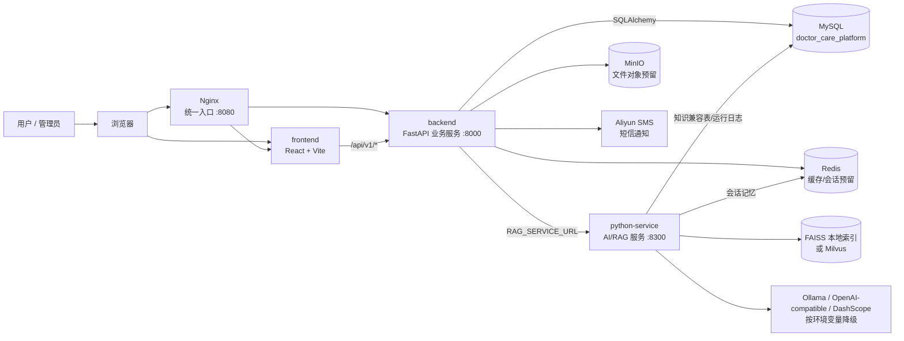

# DoctorCarePlatform 医护陪伴平台

DoctorCarePlatform 是一个面向患者、家属、护理人员和平台管理员的智能医疗陪护与护理匹配平台。项目采用单仓库组织方式，包含 React 前端、FastAPI 业务后端、独立的 Python 智能问诊与知识检索服务，以及由 Docker Compose 管理的 MySQL、Redis、MinIO、Nginx 等基础设施。

## 服务组成

| 目录 | 作用 | 主要技术 |
| --- | --- | --- |
| `frontend` | 前端控制台，覆盖登录注册、身份资料、招聘匹配、护理沟通、智能问诊、审核与知识库管理 | React 19, TypeScript, Vite, lucide-react |
| `backend` | 主业务接口服务，负责账号身份、资料认证、招聘/应聘/邀请、聊天、评价、短信、管理后台和智能问诊网关 | FastAPI, SQLAlchemy, PyMySQL, Redis, httpx |
| `python-service` | 智能问诊与知识检索服务，负责知识入库、向量检索、智能体编排、流式问答、工具调用与运行轨迹 | FastAPI, LangChain, FAISS/Milvus, Redis, MySQL |
| `infra` | Nginx 反向代理和 MySQL 初始化脚本 | Nginx, MySQL 8.4 |
| `scripts` | 本地混合启动、安装和停止脚本 | PowerShell |
| `tests` / `python-service/tests` | 后端网关、认证、知识检索客户端与智能问诊服务单元测试 | pytest |

## 总体架构



更完整的业务流、智能问诊调用链和数据模型图见 [项目流程与架构图.md](项目流程与架构图.md)，可编辑架构图见 [系统架构.drawio](系统架构.drawio)。

## 快速启动

复制 `.env.example` 为 `.env` 仅在需要覆盖默认演示配置、接入真实模型密钥或短信服务时使用。

使用 Docker Compose 启动完整环境：

```powershell
docker compose up --build
```

默认端口：

| 服务 | 地址 |
| --- | --- |
| Nginx 统一入口 | `http://127.0.0.1:8080` |
| Docker 前端 | `http://127.0.0.1:3000` |
| 本地开发前端 | `http://127.0.0.1:5173` |
| 后端接口文档 | `http://127.0.0.1:8000/docs` |
| 智能问诊服务接口文档 | `http://127.0.0.1:8300/docs` |
| MinIO 管理控制台 | `http://127.0.0.1:9001` |

如果 Docker Hub 拉取 `python:3.11-slim` 或 `node:22-alpine` 不稳定，可以使用本地混合启动方式。该方式使用本机 Python/Node 运行应用，只通过 Docker 启动 Redis、MinIO、MySQL：

```powershell
.\scripts\install-local.ps1
.\scripts\start-local.ps1
```

当 MySQL volume 已存在但需要刷新表结构时：

```powershell
.\scripts\init-mysql.ps1
```

停止本地混合启动的服务：

```powershell
.\scripts\stop-local.ps1
```

## 手动开发命令

后端：

```powershell
.\.venv\Scripts\python.exe -m uvicorn backend.app.main:app --reload --host 127.0.0.1 --port 8000
```

AI/RAG 服务：

```powershell
cd python-service
..\.venv\Scripts\python.exe -m uvicorn main:app --reload --host 127.0.0.1 --port 8300
```

前端：

```powershell
cd frontend
npm install --cache .\.npm-cache
npm --cache .\.npm-cache run dev
npm --cache .\.npm-cache run build
```

测试：

```powershell
pytest
cd python-service
..\.venv\Scripts\python.exe -m pytest
```

## 核心能力

- 账号与身份：手机号注册/登录，多角色切换，患者/护理人员资料维护，护理资质提交与审核。
- 护理匹配：患者发布护理招聘，护理人员应聘，患者定向邀请，匹配后自动建立沟通会话。
- 沟通与评价：护理会话、消息发送、服务评价、护理人员评分刷新。
- 智能问诊：前端流式问答，后端保存 AI 会话与消息，Python 服务返回答案、引用来源、步骤和工具调用轨迹。
- 管理后台：用户状态、证书审核、AI 模型配置、内容巡检、知识库入库/删除和管理日志。
- 知识库：后台保存 `ai_knowledge_chunks` 业务记录，并同步调用 Python 服务写入 FAISS/Milvus 与兼容知识表。
- 短信通知：后端记录短信通知，支持 Aliyun SMS 配置和通知重试。

## 关键接口

后端业务接口：

- `GET /health`
- `GET /api/v1/dashboard/summary`
- `POST /api/v1/accounts/register`
- `POST /api/v1/accounts/login`
- `PUT /api/v1/accounts/{user_id}/profiles/patient`
- `PUT /api/v1/accounts/{user_id}/profiles/caregiver`
- `POST /api/v1/jobs`
- `POST /api/v1/jobs/{job_id}/applications`
- `POST /api/v1/jobs/applications/{application_id}/review`
- `POST /api/v1/jobs/invitations`
- `POST /api/v1/jobs/invitations/{invitation_id}/respond`
- `POST /api/v1/conversations/{conversation_id}/messages`
- `POST /api/v1/reviews`
- `POST /api/v1/ai/chat`
- `POST /api/v1/ai/chat/stream`
- `POST /api/v1/admin/knowledge-items`
- `DELETE /api/v1/admin/knowledge-items/{item_id}`

Python 智能问诊与知识检索接口：

- `GET /health`
- `POST /api/ask`
- `POST /api/ask/stream`
- `POST /api/parse`
- `POST /api/summary`
- `POST /api/agent/run`
- `POST /api/agent/run/stream`
- `GET /api/agent/run/{run_id}`
- `GET /api/agent/run/{run_id}/steps`
- `GET /api/agent/run/{run_id}/tool-calls`
- `GET /api/agent/tools`
- `POST /api/v1/knowledge/ingest`
- `DELETE /api/v1/knowledge/{doc_id}`

## 数据库

主库为 MySQL 数据库 `doctor_care_platform`。后端业务表和 Python AI 服务兼容表共用同一个数据库。

后端业务表包括：

- `users`, `user_roles`
- `patient_profiles`, `caregiver_profiles`, `certifications`
- `job_postings`, `applications`, `invitations`
- `conversations`, `messages`
- `ai_sessions`, `ai_messages`, `medical_cases`
- `ai_model_configs`, `ai_knowledge_chunks`, `ai_semantic_cache`
- `reviews`, `sms_notifications`, `admin_logs`

Python AI 服务兼容表包括：

- `knowledge_doc`, `knowledge_chunk`
- `qa_log`, `qa_unanswered`
- `user_memory`
- `agent_run`, `tool_call`

## 重要配置

| 变量 | 说明 |
| --- | --- |
| `DATABASE_URL` | 后端 SQLAlchemy 数据库连接 |
| `MYSQL_HOST`, `MYSQL_PORT`, `MYSQL_DATABASE`, `MYSQL_USERNAME`, `MYSQL_PASSWORD` | Python 服务访问 MySQL |
| `REDIS_URL` | 后端和 Python 服务 Redis 连接 |
| `RAG_SERVICE_URL` | 后端调用 Python 服务的基础地址 |
| `USE_MILVUS` | `false` 时使用 FAISS 持久化目录，`true` 时使用 Milvus |
| `VECTOR_STORE_PERSIST_DIR` | FAISS 索引持久化目录 |
| `VECTOR_STORE_COLLECTION_NAME` | 向量集合名称 |
| `EMBEDDING_MODEL`, `LOCAL_EMBEDDING_MODEL_PATH` | Embedding 模型选择与本地路径 |
| `LLM_FALLBACK_PROVIDERS` | Python 服务 LLM 降级顺序，默认 `ollama,openai_compatible,retrieval` |
| `OLLAMA_BASE_URL`, `OLLAMA_MODEL` | 本地 Ollama 模型配置 |
| `OPENAI_COMPATIBLE_BASE_URL`, `OPENAI_COMPATIBLE_API_KEY`, `OPENAI_COMPATIBLE_MODEL` | OpenAI-compatible 模型配置 |
| `DASHSCOPE_API_KEY`, `DASHSCOPE_MODEL` | DashScope/Qwen 配置 |
| `ALIYUN_SMS_*` | 阿里云短信配置 |

## 生产注意事项

- 为 MySQL 配置独立账号、最小权限、备份与恢复策略。
- 为模型 API key、短信密钥、数据库密码启用生产级密钥管理。
- 为医疗知识来源建立授权、版本、审计和更新流程。
- 对 AI 问答增加医学安全评测、风险提示和人工介入策略。
- 为 Nginx、后端、AI 服务、数据库和对象存储接入日志、监控和告警。
- MinIO 当前主要作为文件对象能力预留；真实附件上传链路上线前需要补齐鉴权、生命周期和病毒/内容安全扫描。
