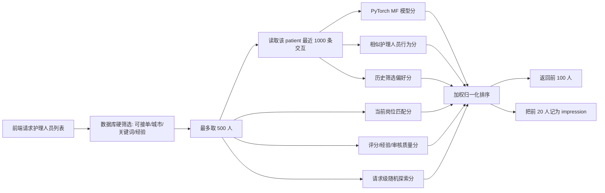
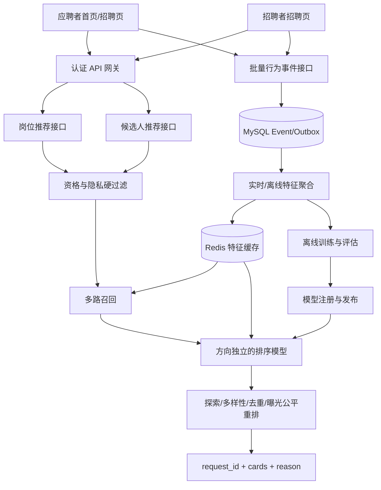
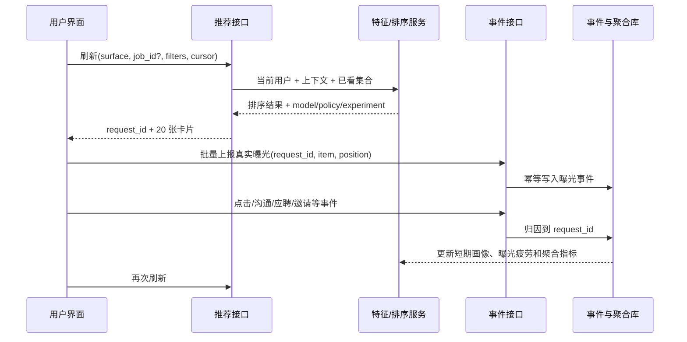

# DoctorCarePlatform 招聘模块推荐系统代码审计与详细设计

> 文档版本：V1.1
> 审计日期：2026-07-24
> 审计对象：`main` 分支当前工作区（包含尚未提交的招聘推荐改动）
> 结论等级：**审计基线有条件不通过；阶段 0 已完成代码整改，完整双边推荐效果仍需阶段 1。**

## 0. 第一次升级实施记录（阶段 0）

实施日期：2026-07-24。此次升级严格对应第 15 章“阶段 0：上线阻断整改”，不把尚未完成的双边行为闭环或学习排序标记为已交付。

| 阶段 0 项目 | 实施结果 | 主要落点 |
|---|---|---|
| 可验证令牌与 `current_user` | 已完成 | 使用 `python-jose 3.5.0` 签发带签名、签发方、过期时间和唯一编号的 JWT；受保护接口从令牌加载正常账号 |
| 角色与资源所有权 | 已完成 | 招聘者、应聘者、管理员按当前激活身份授权；岗位、应聘、邀请、会话、评价和资料接口增加本人/参与方校验 |
| 岗位隐私脱敏 | 已完成 | 非岗位所有者看不到 `patient_id`、精确地点及病人性别、年龄、身高、体重、病症等拼接文本；非公开岗位对外不可见 |
| 候选池硬过滤 | 已完成 | 同时要求账号正常、护理角色审核通过、护理资料审核通过、实名通过且可接单 |
| 前端 403 错误链路 | 已完成 | 招聘者仅为本人岗位加载候选人与应聘；应聘者只加载公开岗位、自己的应聘和邀请 |
| 真实环境演示数据降级 | 已完成 | 招聘接口失败时展示明确错误与空状态，不再把静态演示岗位混入真实账号界面 |
| 幂等、状态机和唯一约束 | 已完成 | 应聘/邀请支持 `Idempotency-Key`；重复请求返回原记录；重复或冲突审核受控；数据库增加唯一约束 |
| 自动化回归 | 已完成 | 新增认证、越权、脱敏、资格过滤、幂等与状态冲突集成测试；后端测试和前端生产构建通过 |

阶段 0 完成后，系统具备继续开发推荐闭环的可信身份与数据边界。但以下内容仍属于阶段 1，不能视为本次升级已实现：

- 应聘者到岗位的个性化推荐接口；
- 双方向统一事件、推荐请求与画像状态表；
- 基于真实可见区域和停留时间的曝光埋点；
- 搜索、筛选、卡片点击在下一次刷新中的双向可测排序变化；
- `request_id`、策略版本、实验版本与曝光归因闭环。

数据库升级需执行：

```powershell
.\.venv\Scripts\alembic.exe upgrade head
```

生产环境必须设置长度不少于 32 个字符的 `AUTH_SECRET_KEY`；继续使用开发密钥或示例数据库密码时，后端会拒绝以生产模式启动。

## 1. 执行摘要

本次审核覆盖后端 FastAPI、SQLAlchemy 数据模型、Alembic/初始化 SQL、PyTorch 推荐模块、训练与演示数据脚本、React 招聘页面及现有测试。审核确认当前代码已经具备一条“病人/雇主查看护理人员”的单边原型链路：

1. 调用护理人员列表接口；
2. 记录筛选条件；
3. 结合质量分、岗位相似度、历史行为、矩阵分解模型和随机探索进行排序；
4. 记录前 20 个返回项的 `impression`；
5. 在查看资料、沟通、邀请、接受或拒绝时写入反馈；
6. 通过离线脚本重新训练 PyTorch 隐式反馈模型。

但该实现与目标效果仍有本质差距：

- **没有“应聘者 → 岗位/雇主”的推荐算法。** 应聘者看到的岗位仍按发布时间倒序，岗位搜索、筛选、卡片点击、沟通、应聘和岗位曝光没有形成推荐反馈。
- **当前招聘页存在高概率失败路径。** 前端会把全局岗位列表第一条岗位作为 `job_id`，再以当前账号作为 `patient_id` 请求候选人；只要该岗位不属于当前账号，后端即返回 403，前端随后整体降级为演示数据。
- **曝光记录不是真实曝光。** 后端把“已返回”直接记为曝光，只记前 20 条，而前端最多展示 100 条；没有可见区域、停留时长、去重和幂等校验。
- **认证授权未落地。** 登录返回的令牌是不可验证的演示字符串，前端请求没有携带令牌，大量接口直接信任请求中的用户编号。任何调用方均可伪装成雇主或应聘者、污染推荐行为甚至执行招聘业务操作。
- **训练标签存在系统性偏差。** 权重为 0 的曝光会被训练代码当作负样本，所有历史事件又被直接汇总成一个净权重；评估指标仅为训练集准确率，无法证明推荐质量。
- **医疗招聘的安全与隐私门槛不足。** 未审核护理人员仍可进入推荐池；招聘描述会拼入病人年龄、疾病、身高体重和详细地点，而岗位列表没有访问控制。

因此建议先完成 P0 安全与数据治理整改，再按“行为闭环 V1 → 双边混合推荐 V2 → 学习排序 V3 → 在线探索 V4”的顺序演进。不要直接在现有 `patient_id + caregiver_id` 事件表上继续堆叠双边逻辑，否则后续会在身份语义、标签方向、曝光归因和模型回滚上形成长期技术债。

## 2. 目标、角色与边界

### 2.1 业务目标

招聘模块需要同时服务两个方向：

| 推荐方向 | 访问者 | 推荐对象 | 首次进入 | 后续刷新依据 | 曝光对象 |
|---|---|---|---|---|---|
| 应聘者侧 | 护理人员/应聘者 | 岗位卡及其雇主信息 | 在合格岗位池内随机探索 | 岗位搜索、筛选、卡片点击、停留、沟通、收藏、应聘、隐藏 | 岗位卡曝光 |
| 招聘者侧 | 病人/家属/招聘者 | 护理人员信息卡 | 在合格候选池内随机探索 | 候选人搜索、筛选、资料点击、停留、沟通、邀请、审核、隐藏 | 候选人卡曝光 |

“随机推荐”不等于无约束的数据库随机。首次推荐必须先经过资格、安全、状态和隐私过滤，再在合格池中进行可复现、分层、多样化的随机探索。

### 2.2 统一术语

- **应聘者（candidate）**：当前业务中的护理人员账号及 `CaregiverProfile`。
- **招聘者（employer）**：发布岗位并管理应聘/邀请的一方，当前主要映射到病人账号。
- **岗位（job）**：`JobPosting`。应聘者侧实际推荐目标应以岗位为主，雇主信息作为岗位卡组成部分。
- **曝光（impression）**：推荐卡至少 50% 进入可视区域并持续达到约定阈值，而不是接口返回。
- **请求（recommendation request）**：一次完整排序结果，必须有唯一 `request_id`，用于事件归因、实验分析和回滚。
- **转化（conversion）**：应聘、邀请、双方沟通、接受、匹配等分层业务结果。

### 2.3 非目标

本设计不把年龄、性别、疾病、身份证号等敏感信息作为学习排序特征；依法或业务上确有必要的条件只能作为透明、可解释、经审批的硬约束，并需要单独审计。推荐系统也不代替资质审核、风控和招聘双方的最终决定。

## 3. 审核范围与验证结果

### 3.1 审核范围

| 层级 | 主要文件/目录 | 审核重点 |
|---|---|---|
| API 与业务 | `backend/app/api/v1/routes/` | 身份、越权、状态流转、行为埋点、异常和事务 |
| 数据模型 | `backend/app/db/models.py`、迁移、初始化 SQL | 约束、索引、双边扩展性、审计字段 |
| 推荐在线服务 | `backend/app/recommendation/service.py`、`model.py` | 冷启动、打分、随机探索、性能和容错 |
| 推荐训练 | `backend/app/recommendation/training.py`、训练脚本 | 标签、负采样、评估、模型发布 |
| 前端 | `frontend/src/main.tsx` | 角色分流、刷新、筛选、卡片点击和曝光采集 |
| 工程质量 | 测试、Ruff、构建、Docker 配置 | 可运行性、质量门禁和部署风险 |

### 3.2 实际验证

- Python `compileall`：通过。
- 全量 Pytest：10 项通过，其中招聘推荐仅 2 项。
- 前端 TypeScript + Vite 生产构建：通过。
- Ruff：全项目 1,647 项；其中 976 项为超长行，另有未使用导入、旧式类型标注、裸 `except` 等。招聘相关选定文件 44 项，主要为格式和 FastAPI `Depends` 规则噪声。Ruff 数量不等同于 1,647 个功能缺陷，但说明目前没有稳定的静态质量门禁。
- 未执行真实 MySQL、Redis、短信、模型热更新和并发压测；现有自动化测试也未覆盖这些路径。

## 4. 当前招聘推荐模块如何运作

### 4.1 代码结构

| 组件 | 当前职责 |
|---|---|
| `backend/app/recommendation/service.py` | 记录事件、构造多路分数、排序护理人员、记录返回列表 |
| `backend/app/recommendation/model.py` | 定义病人—护理人员矩阵分解模型，按模型文件修改时间热加载 |
| `backend/app/recommendation/training.py` | 从交互表聚合隐式反馈、负采样、全量训练并输出 `.pt` |
| `backend/app/api/v1/routes/jobs.py` | 候选人列表、岗位、应聘、邀请、审核接口 |
| `backend/app/api/v1/routes/profiles.py` | 护理人员资料查看并记录 `view` |
| `backend/app/api/v1/routes/conversations.py` | 创建招聘沟通并记录 `chat` |
| `recruitment_interactions` | 保存病人、护理人员、岗位、事件、权重、上下文、请求和模型版本 |
| `frontend/src/main.tsx` | 招聘列表、候选人筛选、刷新、卡片点击、邀请与应聘操作 |

### 4.2 当前在线排序流程



首次没有有意义行为、历史筛选、岗位匹配和模型向量时：

```text
final = 0.20 × quality + 0.80 × random
```

存在历史信息时，系统从以下分量中取可用项后重新归一化：

```text
quality      0.10
exploration  配置值，默认 0.08
model        0.42
behavior     0.24
preference   0.14
job          0.10
```

注意：前端通常会自动带入第一条岗位，因此即使用户没有行为，只要存在岗位分，实际也不会进入纯粹的首次随机分支。

### 4.3 当前规则分说明

- **质量分**：评分 55% + 经验 30% + 审核状态 15%。
- **行为相似度**：把历史查看、沟通、邀请、接受、拒绝过的护理人员作为参考，按城市、经验、评分和简介字符集合相似度计算。
- **筛选偏好**：对最近筛选事件按城市、关键词、最低经验匹配，并做时间衰减。
- **岗位匹配**：岗位城市与护理人员服务城市匹配占 45%，岗位文本与护理人员简介字符 Jaccard 相似度占 55%。
- **随机探索**：由本次请求 UUID 与护理人员编号共同产生随机值，每次刷新会改变。
- **时间衰减**：每天乘以 0.95。

### 4.4 当前离线训练流程

1. 读取所有具有 `caregiver_id` 的招聘交互。
2. 按 `(patient_id, caregiver_id)` 累加 `action_weight`。
3. 净权重大于 0 视为正样本，否则视为负样本。
4. 每个正样本从未正反馈护理人员中随机采 3 个负样本。
5. 使用带用户/护理人员偏置的矩阵分解模型和加权二元交叉熵，全批次训练 120 轮。
6. 在同一训练样本上计算准确率。
7. 将索引、权重、训练时间和指标写入 `.pt` 文件。
8. 在线进程根据文件修改时间重新加载。

当前模型只表达 `patient → caregiver`，没有 `candidate → job` 的用户向量、岗位向量和训练标签。

## 5. 严格代码审计发现

### 5.1 阻断级与高优先级问题

| 编号 | 等级 | 发现与证据 | 影响 | 整改要求 |
|---|---|---|---|---|
| R-01 | P0 | `accounts.py:64-66` 生成不可验证的演示令牌；`main.tsx:2312-2319` 等请求未携带 Authorization；招聘接口直接接收 `patient_id`、`caregiver_id`、`viewer_id` | 任意人可冒用身份、查看或修改他人数据、伪造行为并操纵推荐 | 上线前实现 JWT/会话校验、`current_user` 依赖、RBAC 和资源所有权校验；业务身份只能来自服务端认证上下文 |
| R-02 | P0 | `main.tsx:2429-2461` 把年龄、疾病、身高体重和详细地点拼入岗位文本；`jobs.py:140-158` 岗位列表无认证 | 医疗和位置隐私泄露，且可能被模型学习为敏感特征 | 区分公开摘要与受控详情；精确地址仅在匹配后展示；敏感字段加密、最小化、脱敏和访问审计 |
| R-03 | P1 | `jobs.py:140-158` 岗位只按创建时间排序；推荐模型和事件表均以病人—护理人员为中心 | 完全缺失应聘者侧的雇主/岗位推荐，不满足双边目标 | 建立独立的应聘者→岗位召回、排序、事件和模型链路 |
| R-04 | P1 | `main.tsx:2331-2339` 选全局第一条岗位，`2365-2379` 携带当前账号请求候选人；`jobs.py:223-229` 要求账号是岗位所有者 | 普通招聘者和应聘者高概率收到 403，整个招聘页进入演示数据降级 | 前端按角色拆分数据请求；招聘者只为自己拥有的岗位请求候选人；应聘者不调用候选人推荐接口 |
| R-05 | P1 | `jobs.py:230-239` 仅检查 `is_available`，没有强制 `verification_status == approved`、账号状态和角色有效性 | 未审核或被拒护理人员可获得曝光，医疗护理场景不可接受 | 把认证、账号状态、资质、黑名单、服务状态作为推荐前硬过滤 |
| R-06 | P1 | `service.py:323-352` 在接口返回时把前 20 条记为曝光；接口实际返回 100 条，前端全部渲染 | 曝光量、CTR、位置偏差和训练标签均失真 | 返回 `request_id`；前端用 IntersectionObserver 采集真实可见曝光并批量幂等上报 |
| R-07 | P1 | `profiles.py:207-216` 由可伪造 `viewer_id` 写 `view`；`conversations.py:93-110` 重复点击已有会话也反复写 `chat`；事件无唯一幂等键 | 恶意或重复行为可放大权重，污染画像和模型 | 服务端确定 actor；采用 `event_id/idempotency_key` 唯一约束；定义每类事件去重窗口 |
| R-08 | P1 | `training.py:43-74` 所有净权重不大于 0 的交互都作为负样本，曝光权重 0 因而变成负标签；历史事件无位置校正和时间窗 | 产生曝光偏差、头部强化和错误负反馈 | 曝光默认未标注；只从真实曝光未点击中按位置倾向采弱负样本；使用时间衰减和逆倾向权重 |
| R-09 | P1 | `training.py:123-142` 只报告训练集准确率，没有时间切分、对照基线、Top-K 与覆盖指标 | 无法判断模型是否比规则或随机更好，也无法安全发布 | 建立按时间切分的离线验证、模型注册、阈值门禁、影子流量、A/B 和一键回滚 |
| R-10 | P1 | `service.py:155-169` 每次排序都写 20 行并同步提交；筛选又单独提交；API 为 `async` 但数据库与推荐计算均同步 | 高并发下阻塞事件循环、放大数据库写入，延迟和可用性不可控 | 推荐读取与事件写入解耦；批量写事件/Outbox；为 CPU 排序和训练设置独立服务或工作池 |

### 5.2 中优先级问题

| 编号 | 等级 | 发现与影响 | 建议 |
|---|---|---|---|
| R-11 | P2 | `query.limit(500).all()` 没有稳定排序，超过 500 人时候选截断不可预测，池外人员永远没有曝光机会 | 使用多路召回、稳定游标和分层抽样；记录候选生成原因 |
| R-12 | P2 | 行为相似度复杂度约为候选数 × 交互数，且每次请求重复计算字符集合 | 将实时画像与特征预聚合到 Redis/特征表；限制窗口并缓存 |
| R-13 | P2 | 中文简介使用“单字符集合 Jaccard”，常见字会造成虚假相似，无法理解技能和否定语义 | V1 使用结构化技能标签；V2 使用审核过的文本向量或双塔向量 |
| R-14 | P2 | `record_interaction` 捕获全部异常后只记日志，业务请求继续成功；没有失败计数、死信和补偿 | 事件写入采用 Outbox 或可观测异步队列；设丢失率告警 |
| R-15 | P2 | `action_type` 是自由字符串，权重直接固化在在线代码；缺少事件版本、策略版本和实验编号 | 建立事件枚举、Schema 版本、策略配置中心和模型注册表 |
| R-16 | P2 | `created_at.replace(tzinfo=UTC)` 会把已有时区直接覆盖而非转换 | 统一数据库 UTC；读取后区分 naive/aware 并使用 `astimezone` |
| R-17 | P2 | 模型相对路径依赖进程工作目录；模型只有文件修改时间校验，无哈希、签名、兼容性和原子发布记录 | 使用绝对挂载路径、SHA-256、模型清单和版本注册；先校验后原子切换 |
| R-18 | P2 | 当前 2 个推荐测试只验证“相似人前移”和训练后两个分数关系 | 增加冷启动、双边、过滤、权限、曝光幂等、负反馈、分页、并发和回滚测试 |
| R-19 | P2 | `recruitment_interactions` 只能表达 patient/caregiver；`context_json` 在 ORM、迁移和初始化 SQL 的空值约束不一致 | 迁移到通用双边事件模型，并对 ORM/Alembic/初始化 SQL 做一致性测试 |
| R-20 | P2 | Docker 默认把 MySQL、Redis、MinIO、后端和 Python 服务端口暴露到宿主机，默认口令为演示值 | 生产使用私有网络、密钥管理、最小端口暴露和启动时弱口令拒绝 |

### 5.3 已有实现中值得保留的部分

- 模型文件采用临时文件后原子替换，降低半写入文件被加载的风险。
- `torch.load(..., weights_only=True)` 限制了反序列化范围。
- 推荐模型缺失或未知用户时可回退到规则路径。
- 行为包含时间衰减，且有独立 `model_version` 和 `request_id` 字段雏形。
- 当前测试可在 SQLite 内存库运行，便于扩展快速单元测试。

保留上述部分不代表可以原样上线；它们应迁入新的双边、可审计架构。

## 6. 目标总体架构



### 6.1 分层职责

1. **认证与授权层**：从令牌获得 actor，不接受客户端自报身份；校验角色、岗位所有权和资料可见范围。
2. **资格过滤层**：先处理账号、资质、状态、地域硬约束、拉黑、过期、重复匹配等不可违反条件。
3. **召回层**：从全量对象中并行生成数百个候选，保证覆盖与新对象探索。
4. **排序层**：为两个方向分别预测“下一步有效行为/成功匹配”的概率。
5. **重排层**：处理随机探索、多样性、疲劳、重复、曝光配额和合规约束。
6. **事件层**：采集真实曝光和后续行为，使用幂等键关联推荐请求。
7. **训练发布层**：按时间训练、离线评估、注册、灰度、监控和回滚。

## 7. 双边推荐详细流程

### 7.1 应聘者侧：推荐岗位/雇主

#### 首次进入

1. 认证当前账号具有有效护理人员角色。
2. 构造合格岗位池：已发布、未过期、招聘者账号正常、隐私字段已裁剪、非本人发布、未被隐藏/举报、符合必要资质。
3. 按城市、护理类型、发布时间和新岗位标记分层。
4. 使用 `hash(candidate_id, surface, cold_start_epoch)` 生成稳定随机种子。
5. 在分层池内随机交错，保证同一页不过度集中于同一雇主、城市或护理类型。
6. 返回 20 条，附带 `request_id`；刷新时携带已看集合，优先换一批。

首次推荐只允许以下信息影响结果：资格硬约束、必要地域范围、岗位有效性、内容完整度下限和多样性。不得因为热门或历史转化把新用户冷启动变成头部榜单。

#### 后续推荐

使用以下行为更新短期与长期画像：

- 搜索词提交；
- 城市、护理类型、时间、薪资、服务方式等筛选；
- 岗位卡真实曝光；
- 卡片点击、详情停留、雇主主页点击；
- 收藏、隐藏、举报；
- 发起沟通；
- 提交/撤回应聘；
- 面试或邀请响应；
- 最终匹配及服务评价。

刷新时优先采用最近 30 分钟到 7 天的短期意图，同时保留 30～180 天的长期偏好。一次筛选不应永久覆盖长期画像，连续重复行为才提高权重。

### 7.2 招聘者侧：推荐应聘者

#### 首次进入

1. 认证招聘者并只允许选择自己拥有且可招聘的岗位。
2. 候选池必须满足：护理人员角色有效、账号正常、资质已批准、可接单、服务城市/时间等硬条件、未被拉黑、未处于不可兼容服务状态。
3. 使用岗位作为主要上下文；首次用户没有历史偏好时，仍可基于岗位必要条件过滤，但排序在合格池内随机探索。
4. 随机结果需包含一定比例新候选人，避免评分高者永久垄断。

#### 后续推荐

使用以下行为：

- 候选人姓名/技能搜索；
- 城市、经验、证书、档期、护理类型筛选；
- 候选卡真实曝光；
- 资料点击与停留；
- 收藏、隐藏、举报；
- 发起沟通、邀请；
- 审核应聘、接受、拒绝；
- 最终匹配和服务评价。

“拒绝应聘”应区分原因。岗位已招满、时间不合适、资格不符、主观偏好、候选人主动撤回具有不同含义，不能统一写成 `-6`。部分原因只作用于当前岗位，不应永久降低该护理人员在其他岗位的曝光。

### 7.3 刷新与曝光更新



刷新不是直接给对象的数据库曝光计数加一。只有通过前端可视检测的卡片才产生曝光；事件聚合任务再更新岗位或候选人的小时/日曝光统计。推荐排序使用“曝光疲劳”和“应得曝光”时，必须设上下限，避免单纯追求平均曝光而牺牲匹配质量。

## 8. 推荐算法结构

### 8.1 候选生成（Recall）

每个方向至少保留以下召回通道，并记录 `recall_reason`：

| 通道 | 应聘者 → 岗位 | 招聘者 → 候选人 |
|---|---|---|
| 硬条件召回 | 城市、护理类型、档期、岗位状态 | 城市、技能、证书、档期、审核状态 |
| 内容召回 | 简历技能与岗位结构化标签/文本向量 | 岗位需求与护理人员标签/文本向量 |
| 短期意图召回 | 最近搜索、筛选、点击相似岗位 | 最近筛选和点击相似候选人 |
| 协同召回 | 相似应聘者互动过的岗位 | 相似招聘者/相似岗位互动过的候选人 |
| 转化召回 | 同类型下高质量且不过曝岗位 | 同类型下高质量且不过曝候选人 |
| 探索召回 | 新岗位、低曝光合格岗位 | 新护理人员、低曝光合格护理人员 |

单通道不应直接返回最终结果。建议每通道召回 100～300 条，合并去重后形成约 300～1,000 条排序池。

### 8.2 特征分层

- **用户长期特征**：常用城市、护理类型、时间、薪资区间、技能/证书偏好、历史有效转化。
- **用户短期特征**：最近搜索词、筛选序列、近 30 分钟/1 天/7 天的点击和停留。
- **对象特征**：岗位/候选人状态、结构化标签、质量、完整度、发布时间、近期响应率。
- **交叉特征**：城市距离、技能覆盖、时间重叠、薪资适配、相似度、是否重复曝光。
- **上下文特征**：入口页面、当前岗位、设备、时段、刷新次数、实验组。
- **禁止特征**：身份证号、手机号、精确住址、病史原文、未经批准的敏感属性和可推导歧视属性。

### 8.3 V1 混合排序公式

在数据量不足阶段，先使用透明的混合规则，两个方向分别配置权重：

```text
base =
    w_intent   × S_current_search_filter
  + w_content  × S_content_match
  + w_behavior × S_recent_behavior
  + w_quality  × S_quality
  + w_fresh    × S_freshness
  + w_cf       × S_collaborative

final =
    base
  + exploration_bonus
  + under_exposure_bonus
  - repeat_fatigue_penalty
  - negative_feedback_penalty
```

所有分量先校准到 `[0,1]`，权重从配置读取并带策略版本。硬过滤永远先于分数；被硬过滤对象不能靠曝光补偿或模型高分重新进入。

建议初始权重：

| 方向 | 当前意图 | 内容 | 近期行为 | 质量 | 新鲜度 | 协同 | 探索上限 |
|---|---:|---:|---:|---:|---:|---:|---:|
| 应聘者 → 岗位 | 0.30 | 0.25 | 0.15 | 0.10 | 0.10 | 0.10 | 10% |
| 招聘者 → 候选人 | 0.25 | 0.30 | 0.15 | 0.15 | 0.05 | 0.10 | 10% |

这是启动参数，不是永久常量。必须通过离线回放和在线实验调整。

### 8.4 冷启动策略

#### 新用户

- “首次”由 `recommendation_user_state` 明确记录，不通过“有没有正反馈”猜测。
- 随机种子在一个会话或冷启动周期内稳定，避免页面抖动。
- 刷新携带最近已看集合，池未耗尽前不重复。
- 至少 20% 探索槽位分配给新对象/低曝光对象，其余在合格池分层随机。
- 用户第一次主动筛选后立即切换到“显式意图 + 探索”模式。

#### 新岗位/新候选人

- 使用内容特征和资格质量进入召回，不等待协同向量。
- 设置受控的新对象曝光预算。
- 在获得足够真实曝光后再计算 CTR/转化率，使用贝叶斯平滑避免小样本极值。

### 8.5 学习模型演进

#### V2：方向独立的隐式反馈模型

- 模型 A：`candidate_embedding × job_embedding`；
- 模型 B：`employer_or_job_context_embedding × candidate_embedding`；
- 训练使用 BPR、sampled softmax 或加权二元损失；
- 曝光未点击只作为弱负样本，并按位置倾向和观察窗口修正；
- 使用时间切分，避免未来信息泄漏。

#### V3：双塔召回 + 学习排序

- 双塔模型用于大规模近邻召回；
- 排序可使用 LightGBM/XGBoost 或 PyTorch 多层网络；
- 多任务预测 `click/chat/apply_or_invite/match`；
- 最终分数以成功匹配为主目标，同时加入响应、质量、投诉和公平约束。

#### V4：受控在线探索

- 在安全合格池中采用 epsilon-greedy、Thompson Sampling 或 LinUCB；
- 探索只占有限槽位；
- 记录 propensity，支持无偏离线评估；
- 设转化、投诉、延迟和公平性护栏，异常自动退回 V1 规则。

## 9. 行为事件与标签设计

### 9.1 统一事件表

建议新增 `recruitment_events`，不要继续把双边语义塞入 `patient_id/caregiver_id`：

| 字段 | 类型/约束 | 说明 |
|---|---|---|
| `id` | UUID，主键 | 服务端事件编号 |
| `idempotency_key` | VARCHAR，唯一 | 客户端重试和去重 |
| `actor_id` | FK users，非空 | 从认证上下文取得 |
| `actor_role` | ENUM | `candidate` / `employer` |
| `target_type` | ENUM | `job` / `candidate` / `employer` |
| `target_id` | VARCHAR，非空 | 被操作对象 |
| `job_id` | 可空 FK | 上下文岗位 |
| `employer_id` | 可空 FK | 归一化招聘者 |
| `candidate_id` | 可空 FK | 归一化应聘者 |
| `event_type` | ENUM，非空 | 事件类型 |
| `event_value` | DECIMAL/JSON | 停留时长、拒绝原因等 |
| `surface` | VARCHAR | 首页、招聘页、搜索结果等 |
| `request_id` | VARCHAR，索引 | 关联推荐请求 |
| `session_id` | VARCHAR，索引 | 会话归因 |
| `position` | INT | 展示位置 |
| `model_version` | VARCHAR | 模型版本 |
| `policy_version` | VARCHAR | 规则/权重版本 |
| `experiment_id` | VARCHAR | 实验组 |
| `context_json` | JSON | 已脱敏筛选和环境 |
| `occurred_at` | UTC DATETIME | 客户端发生时间 |
| `received_at` | UTC DATETIME | 服务端接收时间 |

推荐请求另存 `recommendation_requests`；小时/日聚合另存 `item_exposure_daily`，避免每次排序扫描原始事件。

### 9.2 事件采集规范

| 事件 | 触发条件 | 去重建议 | 标签使用 |
|---|---|---|---|
| `impression` | 卡片 ≥50% 可见且 ≥1 秒 | request + item 唯一 | 未标注；可用于弱负采样和曝光统计 |
| `card_click` | 打开详情 | 30 秒内同 request 去重 | 弱正 |
| `dwell` | 详情停留达到阈值 | 分桶上报一次 | 弱正，过滤后台挂起 |
| `search_submit` | 用户确认搜索 | 相同查询 10 秒去重 | 更新短期意图 |
| `filter_apply` | 用户确认筛选 | 相同规范化筛选 10 秒去重 | 更新短期意图 |
| `favorite` | 主动收藏 | 状态事件 | 中正 |
| `chat_start` | 首次发起有效沟通 | 双方+上下文按天去重 | 强正 |
| `apply` | 应聘成功创建 | 业务主键唯一 | 强正，仅应聘者→岗位 |
| `invite` | 邀请成功创建 | 业务主键唯一 | 强正，仅招聘者→候选人 |
| `accept/match` | 状态合法转换 | 状态机幂等 | 最强正 |
| `hide/report` | 明确负反馈 | 状态事件 | 强负/风控，不跨场景滥用 |

搜索词应规范化、限长并按隐私策略保存；不得把病历原文或身份证号写入事件上下文。

### 9.3 标签窗口和方向

- 点击：曝光后 30 分钟内归因；
- 沟通：曝光后 7 天内归因；
- 应聘/邀请：曝光后 14 天内归因；
- 匹配：曝光后 30 天内归因；
- 超过窗口的自然业务行为可保留，但不应错误归因到过期请求。

招聘者拒绝应聘不是应聘者对岗位的负偏好；应聘者拒绝邀请也不等于招聘者认为候选人质量差。训练集必须按 actor 方向解释事件。

## 10. API 设计

### 10.1 推荐接口

```http
GET /api/v1/recruitment/recommendations/jobs
Authorization: Bearer <token>
?limit=20&cursor=...&city=上海&care_type=术后护理&refresh=true
```

```http
GET /api/v1/recruitment/recommendations/candidates
Authorization: Bearer <token>
?job_id=<owned-job-id>&limit=20&cursor=...&refresh=true
```

统一响应：

```json
{
  "request_id": "rec_...",
  "surface": "candidate_job_feed",
  "model_version": "candidate-job-v2.3.1",
  "policy_version": "policy-2026-07-24",
  "experiment_id": "exp_job_feed_07:B",
  "next_cursor": "...",
  "items": [
    {
      "target_type": "job",
      "target_id": "...",
      "position": 1,
      "reason_code": "RECENT_FILTER_AND_SKILL_MATCH",
      "card": {}
    }
  ]
}
```

客户端不应获得原始模型分，以免被用于逆向和操纵；可返回经过审核的推荐理由码。

### 10.2 事件接口

```http
POST /api/v1/recruitment/events/batch
Authorization: Bearer <token>
Idempotency-Key: <batch-id>
```

```json
{
  "events": [
    {
      "idempotency_key": "device-event-uuid",
      "request_id": "rec_...",
      "target_type": "job",
      "target_id": "...",
      "event_type": "impression",
      "position": 1,
      "occurred_at": "2026-07-24T08:00:00Z",
      "event_value": {"visible_ms": 1430, "visible_ratio": 0.72}
    }
  ]
}
```

服务端根据令牌写入 `actor_id` 和 `actor_role`，并核对 `request_id` 中的对象、位置和实验，拒绝伪造对象。

### 10.3 业务状态机

应聘、邀请、审核和匹配接口必须：

1. 校验身份与资源所有权；
2. 校验旧状态到新状态的合法迁移；
3. 在同一数据库事务中写业务状态和 Outbox 事件；
4. 事务提交后异步发短信和更新特征；
5. 重复请求通过业务唯一键/幂等键返回原结果。

## 11. 数据、缓存与性能设计

### 11.1 在线读取

- MySQL 保存权威账号、岗位、资格、状态、事件和模型注册信息。
- Redis 保存短期画像、最近已看集合、曝光疲劳、热门/新对象候选集及排序特征。
- 推荐请求使用游标而非页码；游标包含策略版本、会话和候选快照标识。
- 目标 P95：缓存命中时 200 ms 内，降级规则 300 ms 内；事件批量上报 P95 100 ms 内。

### 11.2 降级顺序

1. 当前正式模型；
2. 上一个健康模型；
3. V1 混合规则；
4. 合格池分层随机；
5. 无合格对象时返回明确空态。

严禁因为后端失败而把静态演示数据混入真实账号界面。演示模式应由明确环境开关控制。

### 11.3 曝光与疲劳

- Redis 集合记录用户最近 7～30 天已看对象；
- 同一对象在一个会话内限制重复展示；
- 业务对象日聚合包含 `impressions`、`unique_viewers`、`clicks`、`chats`、`applies/invites`、`matches`；
- 对曝光量使用去重用户数和置信区间，不直接以原始次数形成热门分；
- 过曝惩罚与低曝光补偿均设上限。

## 12. 模型训练、评估与发布

### 12.1 数据集构建

1. 固化事件 Schema 版本。
2. 按方向生成样本，不混用标签语义。
3. 使用真实曝光构造风险集。
4. 按时间窗口做训练/验证/测试切分。
5. 对位置偏差使用 propensity 或分桶权重。
6. 对用户、岗位、候选人删除请求执行训练数据删除/重建。
7. 保存数据快照编号、特征版本和代码提交号。

### 12.2 离线指标

主指标：

- Recall@20；
- NDCG@20；
- MRR@20；
- 有效沟通/应聘/邀请/匹配的加权 NDCG；
- 覆盖率、新对象覆盖率、重复率；
- 曝光 Gini 或分位差；
- 分城市、护理类型、资质类别的稳定性。

辅助指标：

- AUC/LogLoss；
- 校准误差；
- 预测和实际转化曲线；
- 规则基线与随机基线提升。

仅训练准确率不得作为发布门槛。

### 12.3 在线指标与护栏

业务指标：

- 卡片 CTR；
- 有效详情停留率；
- 应聘率/邀请率；
- 双方回复率；
- 成功匹配率；
- 首次匹配耗时；
- 7/30 天留存。

护栏指标：

- 403/5xx、空结果率、推荐 P95/P99；
- 事件丢失率和重复率；
- 投诉、隐藏、举报率；
- 未认证对象曝光数必须为 0；
- 敏感字段进入事件/特征数必须为 0；
- 分群曝光差异和新对象冷启动覆盖。

### 12.4 模型注册与发布

`model_registry` 至少包含：

- 方向、版本、格式和状态；
- 文件 URI、SHA-256、大小；
- 数据快照、特征版本、代码提交；
- 离线指标和审批人；
- 创建、灰度、全量、回滚时间；
- 兼容的 Schema/运行时版本。

发布流程：离线门禁 → 影子评分 → 1% 灰度 → 10% → 50% → 全量。每级至少观察一个完整业务周期或达到最小样本量；护栏触发自动回滚。

## 13. 安全、隐私、公平与反作弊

### 13.1 身份与权限

- 所有招聘写接口和个性化读接口必须认证。
- `current_user.id` 替代请求体/查询参数中的 actor。
- 招聘者推荐候选人时校验 `job.employer_id == current_user.id`。
- 应聘者只能以自己的护理人员身份应聘。
- 管理接口单独使用管理员角色和审计日志。
- 访问令牌短期有效，刷新令牌轮换，可撤销。

### 13.2 隐私

- 岗位卡只显示大致区域，不显示精确病房/门牌。
- 病史、身份证号、手机号和精确位置不进入推荐事件、日志和模型。
- 事件保存周期建议 180 天，聚合数据按业务/法律要求保留；支持用户删除。
- 模型产物中的用户编号应使用内部不可逆映射或受控标识。

### 13.3 公平

- 禁止使用无合法必要性的敏感属性。
- 资格条件需有理由码，用户可以看到“为何不匹配”的非歧视性解释。
- 定期审计城市、护理类型、新老用户、资质类别的覆盖和转化差异。
- 曝光公平只在安全合格池中执行。

### 13.4 反作弊

- 事件接口限流，校验 request/object/position；
- 设备与账号异常速率检测；
- 重复点击/沟通/刷新按窗口去重；
- 训练前过滤自刷、脚本、异常 IP 和批量账号；
- 不把未经验证的评分或点击量直接当质量。

## 14. 测试与验收设计

### 14.1 自动化测试矩阵

| 测试层 | 必测场景 |
|---|---|
| 单元 | 冷启动随机稳定性、刷新不重复、硬过滤、分数归一化、负反馈方向、时间衰减 |
| API 集成 | 两方向推荐、认证、岗位所有权、事件幂等、游标、空池、降级 |
| 数据库 | Alembic 升降级、ORM/迁移/初始化 SQL 一致、唯一键并发 |
| 端到端 | 两种角色首次进入、搜索筛选、卡片点击、曝光、刷新、应聘/邀请/匹配 |
| 模型 | 时间切分、无未来泄漏、未知用户/对象、版本兼容、损坏文件回滚 |
| 性能 | 1k/10k/100k 用户和对象规模下 P95、数据库写放大、缓存失效 |
| 安全 | IDOR、伪造 actor、越权岗位、事件重放、敏感字段泄漏、限流 |
| 公平 | 分群覆盖、曝光差异、新对象曝光、过度重复 |

### 14.2 目标效果验收标准

以下条件全部满足，才可认定实现了本需求：

1. 新应聘者首次在首页/招聘页看到合格岗位的分层随机推荐，刷新优先换一批。
2. 新招聘者为自己的岗位看到合格护理人员的分层随机推荐。
3. 两个方向的搜索、筛选和卡片点击在下一次刷新中产生可测试的排序变化。
4. 岗位卡和候选卡只在真实可见时增加曝光，重复上报不重复计数。
5. 应聘者侧岗位推荐与招聘者侧候选人推荐拥有独立事件语义、模型版本和指标。
6. 未认证、停用、未审核或无权限对象不会进入结果。
7. 任意客户端修改用户编号都不能冒充他人或污染他人画像。
8. 推荐接口返回 `request_id/model_version/policy_version`，后续行为可以准确归因。
9. 模型不可用时自动降级，且不展示演示数据。
10. 离线和在线指标达到门槛，能按版本一键回滚。

## 15. 后续开发路线

### 阶段 0：上线阻断整改（建议 1～2 周）

目标：先让身份、权限、隐私和业务状态可信。

- 实现可验证令牌、`current_user`、角色与所有权校验；
- 隐藏岗位卡中的精确位置和敏感病人资料；
- 候选池强制账号正常、角色有效、资质批准、可接单；
- 修复前端按全局第一岗位请求候选人的 403 链路；
- 禁止真实环境自动显示演示数据；
- 为应聘、邀请、状态迁移增加幂等和数据库唯一约束。

### 阶段 1：双边行为闭环 V1（建议 2～3 周）

目标：不依赖机器学习，也能完整实现需求。

- 新建通用 `recruitment_events`、`recommendation_requests`、聚合表和用户状态表；
- 新增岗位推荐与候选人推荐两个接口；
- 前端按角色拆分招聘页；
- 用 IntersectionObserver 采集真实曝光；
- 实现分层随机冷启动、搜索/筛选/点击画像、刷新去重；
- 采用配置化混合规则排序；
- 建立事件质量和曝光仪表盘。

### 阶段 2：离线模型 V2（建议 3～5 周）

目标：在完整事件上训练方向独立模型。

- 构建按时间切分的数据集；
- 修正曝光偏差和负采样；
- 实现 candidate→job 与 employer/job→candidate 两套嵌入或双塔模型；
- 建立模型注册、影子评分、灰度和自动回滚；
- 与 V1 规则做离线/在线对照。

### 阶段 3：学习排序与实时特征 V3（建议 4～6 周）

目标：提升匹配成功而非只提升点击。

- Redis 实时画像与已看集合；
- 多路召回和 ANN；
- 多任务学习点击、沟通、应聘/邀请和匹配；
- 加入多样性、疲劳、新对象和公平重排；
- 建立完整 A/B 实验平台。

### 阶段 4：受控探索 V4（持续）

目标：在不破坏安全和体验的前提下持续学习。

- 带 propensity 的在线 Bandit；
- 自动权重调优；
- 异常流量和作弊检测；
- 周期性公平、隐私和模型漂移审计。

## 16. 建议代码改造地图

| 文件/模块 | 建议变更 |
|---|---|
| `backend/app/services/auth.py` | 增加签名令牌、解析、撤销和 `current_user` |
| `backend/app/api/v1/router.py` | 对受保护路由挂载认证/角色依赖 |
| `backend/app/api/v1/routes/jobs.py` | 拆分普通列表与个性化岗位推荐；所有权和状态机校验 |
| `backend/app/api/v1/routes/profiles.py` | 删除可伪造 `viewer_id`，资料可见性按认证上下文判断 |
| `backend/app/api/v1/routes/conversations.py` | 只在首次有效沟通写事件，正确带 `job_id` |
| `backend/app/recommendation/service.py` | 拆为 eligibility、recall、rank、rerank、explain、fallback |
| `backend/app/recommendation/model.py` | 支持两个方向、模型清单、哈希验证和健康回退 |
| `backend/app/recommendation/training.py` | 时间切分、方向标签、曝光偏差修正、Top-K 评估 |
| `backend/app/db/models.py` | 新增通用事件、请求、聚合、用户状态和模型注册表 |
| `frontend/src/main.tsx` | 按角色拆页，封装带 Authorization 的 API 客户端，真实曝光埋点 |
| `tests/` | 增加 API、权限、双边、幂等、迁移、性能和端到端测试 |
| `scripts/` | 训练、评估、注册、灰度和回滚分离；演示数据显式标记 |

当功能继续增长时，应把当前单个 3,600 多行的 `frontend/src/main.tsx` 拆为招聘页面、卡片、筛选器、API 客户端、事件采集和状态管理模块，降低双边逻辑互相污染的风险。

## 17. 推荐模块建议目录

```text
backend/app/recommendation/
├── domain/
│   ├── enums.py
│   ├── events.py
│   └── policies.py
├── eligibility/
│   ├── jobs.py
│   └── candidates.py
├── recall/
│   ├── content.py
│   ├── collaborative.py
│   ├── behavior.py
│   └── exploration.py
├── ranking/
│   ├── candidate_job.py
│   ├── employer_candidate.py
│   ├── features.py
│   └── rerank.py
├── serving/
│   ├── job_feed.py
│   ├── candidate_feed.py
│   └── fallback.py
├── training/
│   ├── dataset.py
│   ├── train_candidate_job.py
│   ├── train_employer_candidate.py
│   └── evaluate.py
├── registry/
│   └── model_store.py
└── observability/
    └── metrics.py
```

该结构把两个推荐方向共享的基础设施与方向特有的标签/模型分开，后续升级双塔、学习排序或 Bandit 时不需要再次改写业务接口。

## 18. 最终建议

当前推荐代码可以保留为概念验证和 V1 规则排序的参考，但不应继续以“给现有列表加一个模型分”的方式扩展。正确的后续开发顺序是：

1. 先解决身份、权限、隐私、资质硬过滤和前端 403；
2. 再建立真实、幂等、双边的行为与曝光闭环；
3. 先用透明规则达到完整业务效果；
4. 数据质量达标后再上线方向独立模型；
5. 最后用灰度实验和受控探索持续优化。

如果阶段 1 尚未完成，任何更复杂的 PyTorch 模型都会主要学习错误曝光、伪造身份和单边事件产生的偏差，模型复杂度不会弥补数据闭环缺失。
