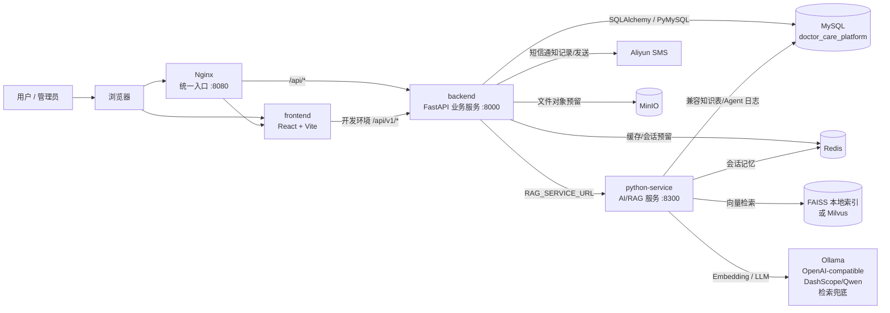
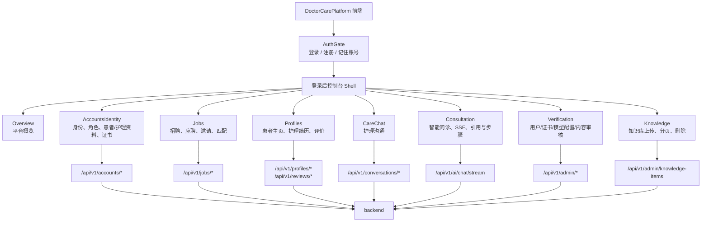
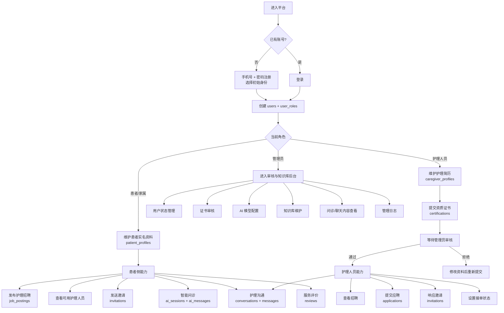
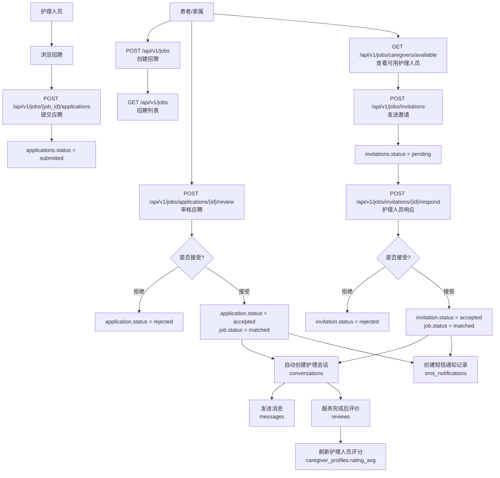
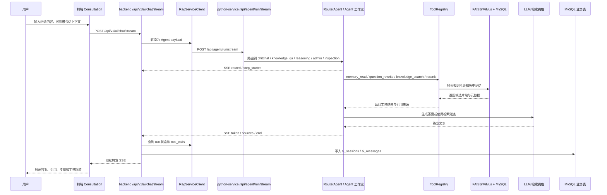
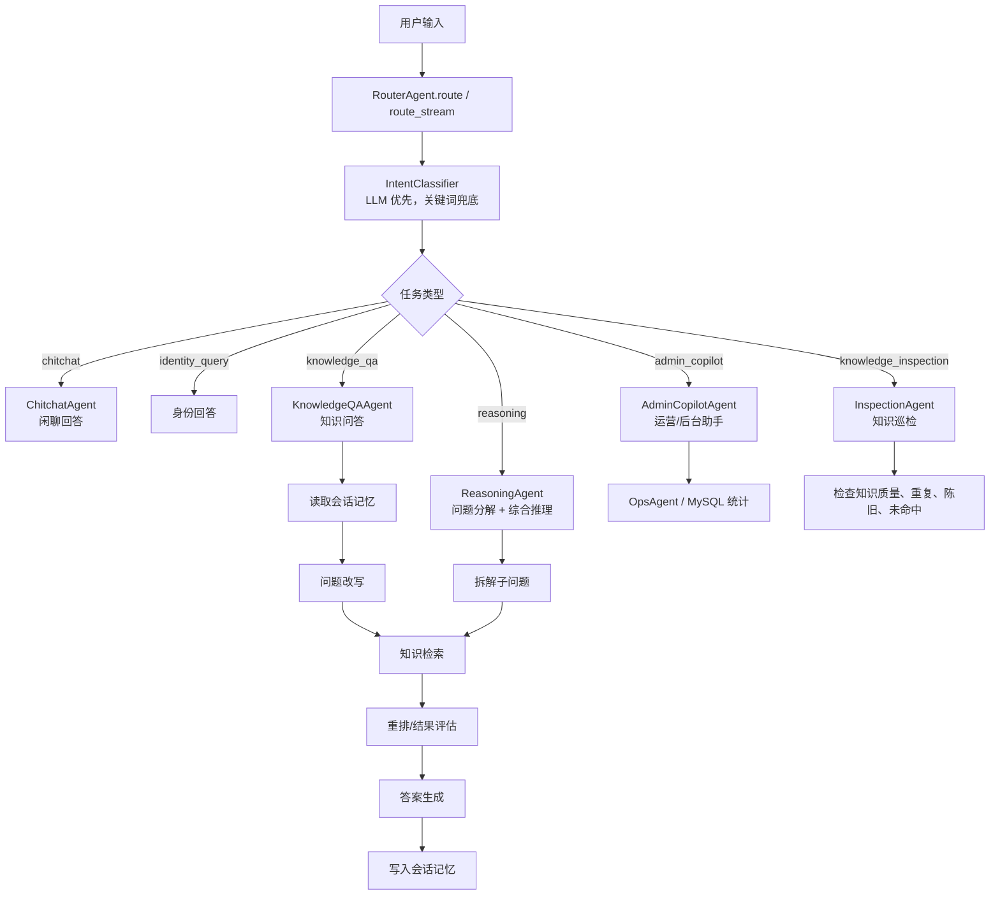
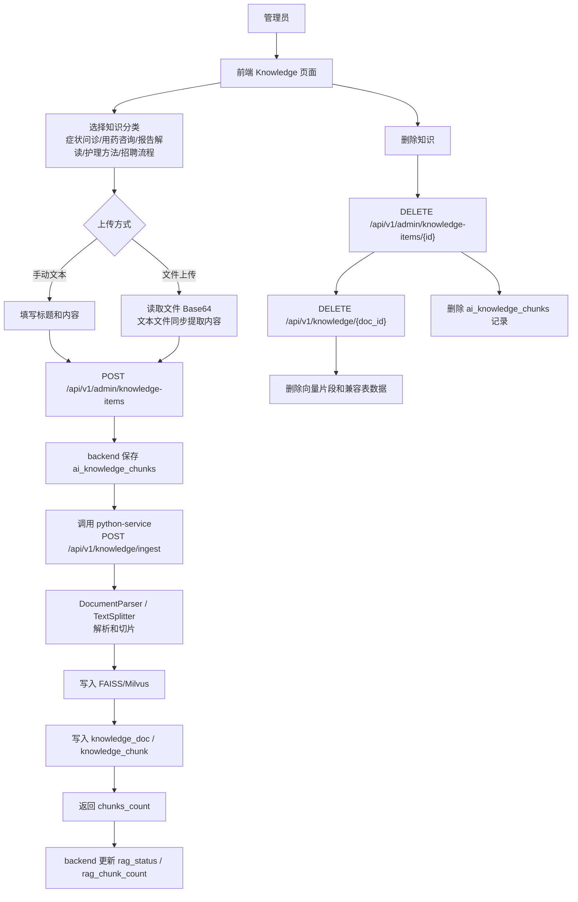
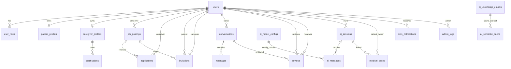
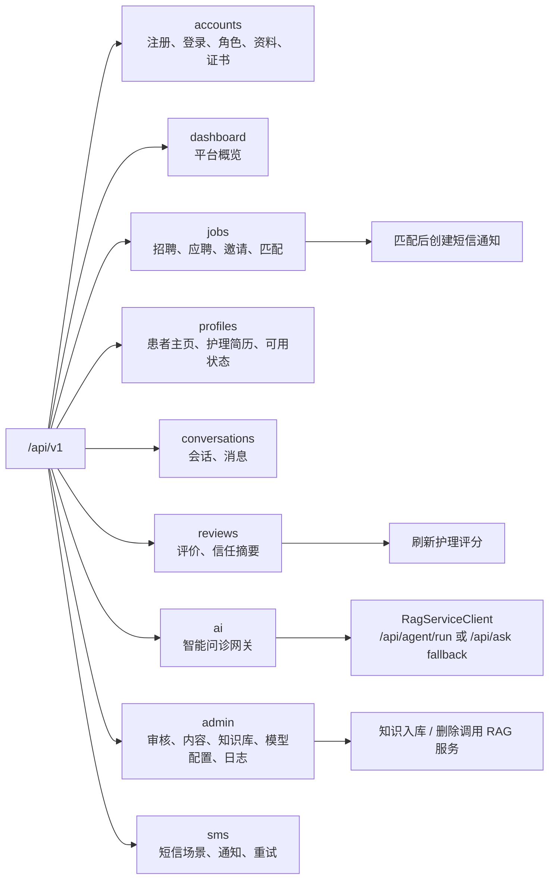
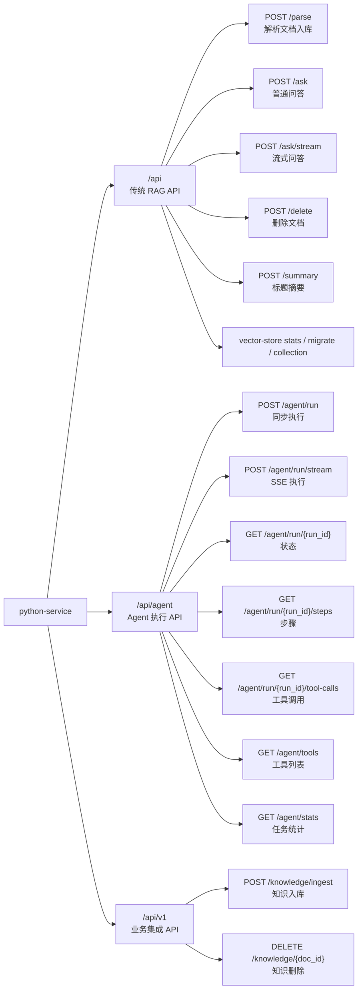

# DoctorCarePlatform 工作流程与架构图

本文档根据当前代码整理，覆盖 `frontend`、`backend`、`python-service` 与基础设施之间的协作方式。可编辑版本同步维护在 [系统架构.drawio](系统架构.drawio)。

## 1. 系统总体架构

### 说明

- 前端在 Docker 场景可通过 Nginx 统一入口访问；本地开发时 Vite 默认运行在 `5173`。
- Nginx 当前将 `/api/` 转发到 `backend`，后端再作为 AI 网关访问 `python-service`。
- MySQL 是单一共享数据库，既保存业务表，也保存 Python AI 服务的兼容知识表和运行日志表。
- Redis、MinIO 已纳入 compose 和配置，其中 Redis 被 Python 服务用于会话记忆，MinIO 主要作为附件对象能力预留。

## 2. 前端功能地图

## 3. 用户身份与主业务流程

## 4. 护理招聘与匹配闭环

## 5. 智能问诊流式调用链

## 6. Python Agent 内部流程

## 7. 管理员知识库维护流程

## 8. 核心数据关系

## 9. 后端 API 模块地图

## 10. Python Service API 模块地图

## 11. 阅读建议

1. 先看“系统总体架构”，明确三类应用服务和基础设施的边界。
2. 再看“用户身份与主业务流程”，理解患者、护理人员、管理员三类角色。
3. 接着看“护理招聘与匹配闭环”，这是平台业务主线。
4. 然后看“智能问诊流式调用链”和“Python Agent 内部流程”，理解 AI 问诊的网关、编排、工具和持久化。
5. 最后看数据关系和 API 模块地图，回到代码时更容易定位文件。
